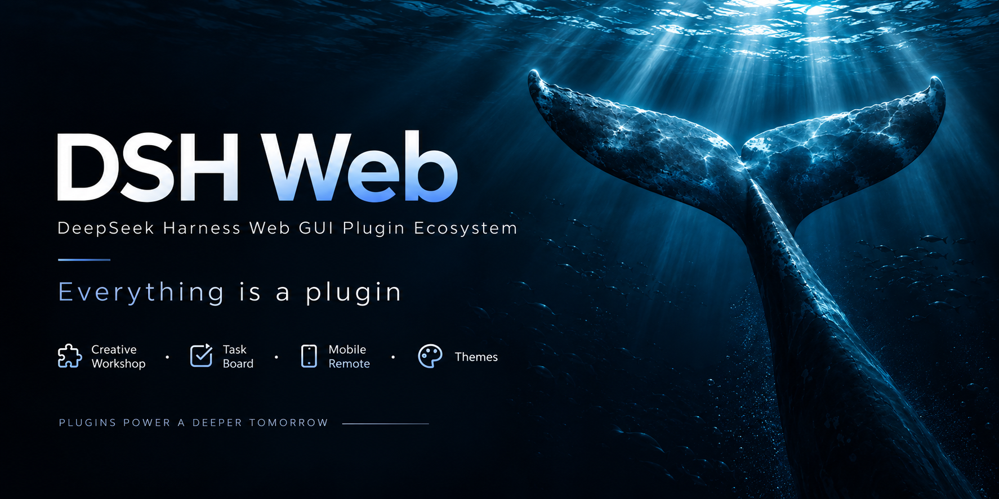
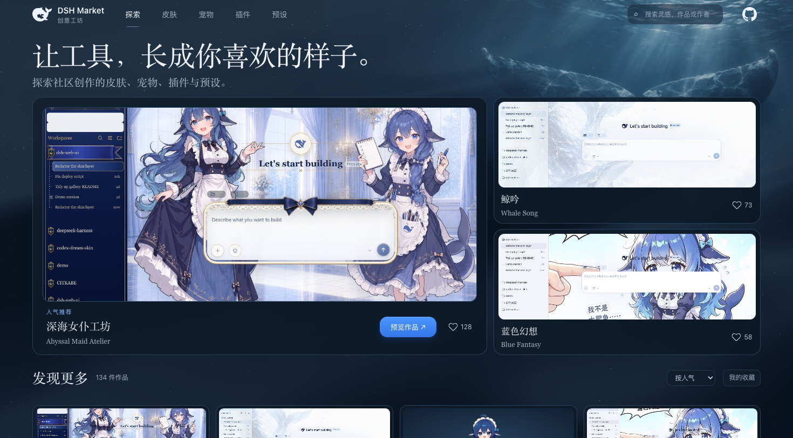
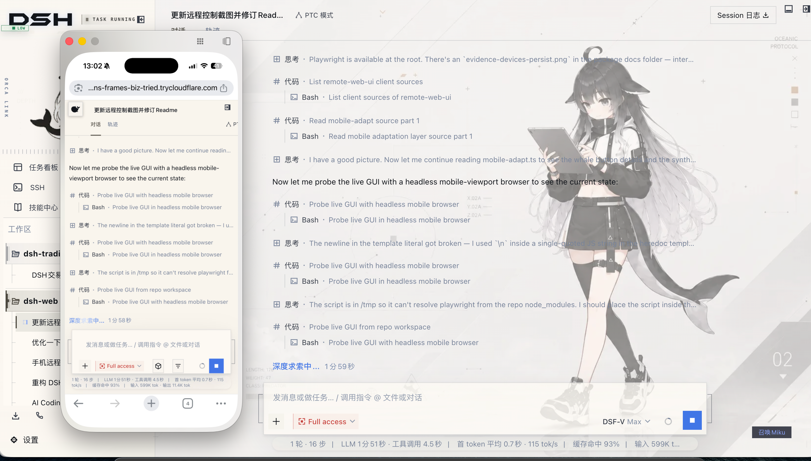
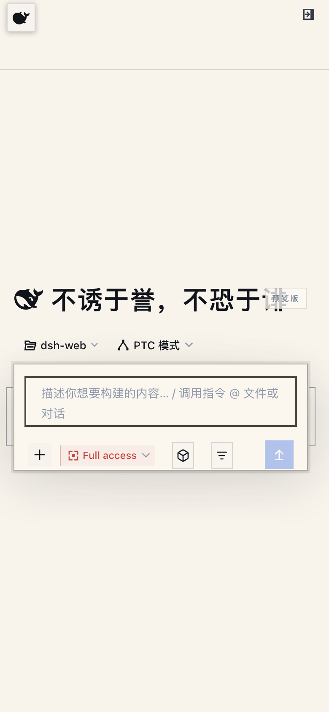
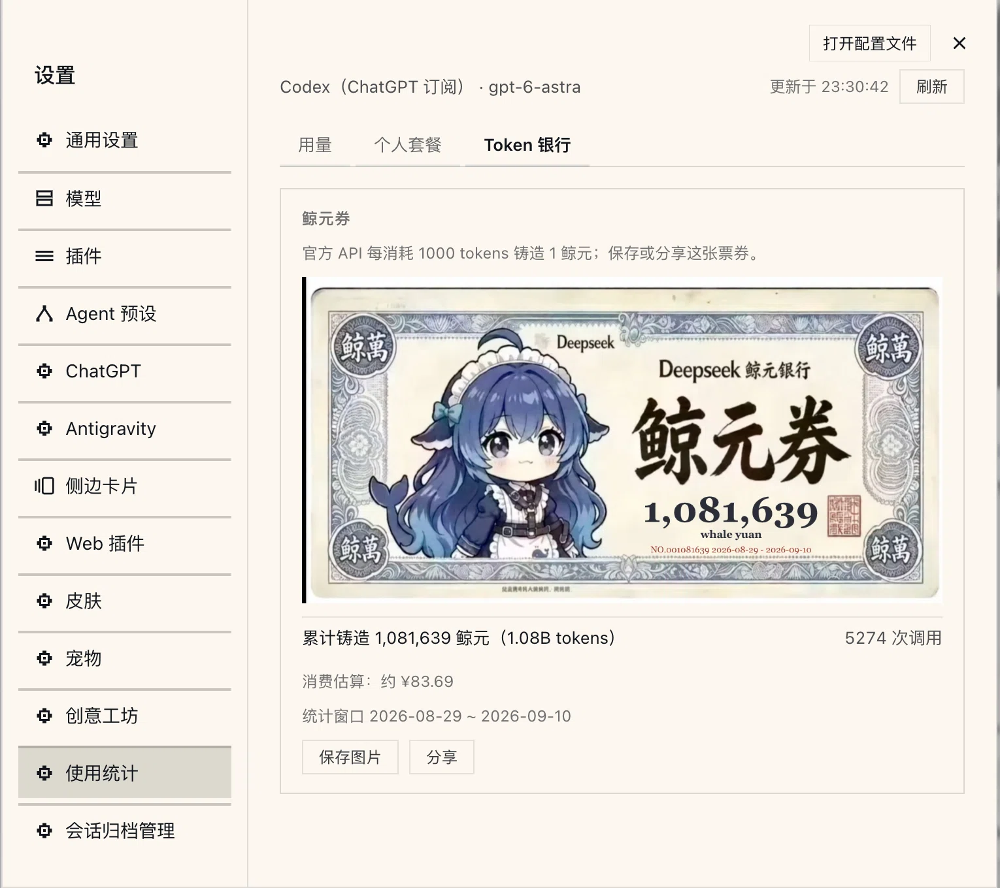

# dsh-web · DeepSeek Harness Web GUI Plugins & Themes

[中文](README.md) | English

dsh-web is an open-source plugin collection for the DeepSeek Harness (DSH) Web GUI, extending your AI coding workspace with task automation, mobile remote control, SSH terminals, Git visualization, and custom themes. Install the plugin bundle into `dsh web`, or download DSH Desktop for macOS and Windows with the runtime and plugins included.

<p align="center">
  
</p>

<p align="center">
  
  &nbsp;
  
  &nbsp;
  
  &nbsp;
  <a href="https://www.npmjs.com/package/@linxin666/dsh-web-all"></a>
  &nbsp;
  <a href="https://www.npmjs.com/package/@linxin666/dsh-web-all"></a>
  &nbsp;
  <a href="https://dshfind.com/zh/plugins/zhu1090093659/dsh-web?ref=badge"></a>
  &nbsp;
  <a href="https://dsh-market.com"></a>
  &nbsp;
  <a href="https://www.npmjs.com/package/@deepseek-ai/dsh"></a>
  &nbsp;
  
</p>

<p align="center">
  <strong>The aggregate plugin ecosystem for DeepSeek Harness (DSH) Web · Everything is a plugin</strong><br>
  <em>Workshop · Task Board · Mobile Remote · SSH Ops · Usage Statistics</em>
</p>

<div align="center">

[What It Is](#what-it-is) · [DSH Desktop](#dsh-desktop-desktop-client) · [Workshop](#workshop-dsh-marketcom) · [Feature Plugins](#feature-plugins) · [Skins](#skins) · [Quick Start](#quick-start) · [FAQ](#faq) · [Known Limitations](#known-limitations) · [Community](#community)

</div>

## What It Is

Each feature ships as an independent plugin: task board, mobile remote control, SSH remote operations, usage statistics, custom model capabilities, session archive management, and the right panel. Install the bundle or choose individual plugins; all mount through the official `dsh web` profile mechanism without modifying DSH source code. The bundle also integrates external plugins such as `dsh-better-sidebar`; see the [plugin bundle installation and configuration guide](packages/dsh-web-all/README.md).

Themes are asset packs loaded by the skins plugin: a `skin.json` manifest, styles, artwork, and optional effect scripts. Plugins provide behavior; skin assets customize appearance. Blue Fantasy is bundled with the skins plugin, while additional themes and pet assets are available from the [DSH Workshop](#workshop-dsh-marketcom).


| Capability | Stock dsh web | dsh-web family |
| --- | --- | --- |
| Agent presets | Official presets (Standard / Minimal…) | Official and community presets |
| Custom model capabilities | None | Declare image input and reasoning efforts per model, and disable / re-enable custom providers |
| Task board | None | Multi-column board + cron-scheduled real runs |
| Mobile remote control | None | QR pairing with SSE real-time sync; the same link also pairs a PC browser |
| Remote server ops | None | SSH panel: terminal / transfer / tunnels / cluster |
| Usage statistics | None | Token usage, provider balances, plan quotas, and Token Bank |
| File preview & changes | None | Right panel: explorer / editor / terminal / git / browser |
| Git visualization | None | Branch picker + commit history graph |
| Session archive | None | Browse and filter every session, batch archive / restore / delete with automatic policies |
| Themes & skins | Default theme | Blue Fantasy ships with the skins plugin; other skins install from the Workshop |

### Find the Right DSH Extension

| What you want to do | Where to start |
| --- | --- |
| Run and schedule AI agent tasks | [Task board and cron scheduling](packages/dsh-task-board/README.md) |
| Access DSH from a phone or another computer | [Mobile and PC browser remote control](packages/dsh-remote-web-ui/README.md) |
| Manage remote servers over SSH | [SSH terminals, file transfers, and tunnels](packages/dsh-ssh/README.md) |
| Customize themes and pets | [Browse the DSH Workshop](https://dsh-market.com) |
| Use a macOS or Windows desktop app | [DSH Desktop downloads and requirements](#dsh-desktop-desktop-client) |
| Add the plugin bundle to an existing DSH install | [Plugin installation quick start](#quick-start) |

## DSH Desktop (Desktop Client)

DSH Desktop turns the DeepSeek Harness Web GUI into an installable desktop app for macOS and Windows: the installer bundles a standalone Node.js runtime (with npm and pnpm), the dsh host, and a preinstalled web profile (the official web bundles plus the dsh-web family), so it works on double-click with no Node, npm or dsh CLI setup. Installers ship as the `dsh-desktop-*` assets of every [Release](https://github.com/zhu1090093659/dsh-web/releases) (macOS dmg / zip, Windows exe / zip).

- **Own host, dedicated ports**: the app starts its own dsh host with the bundled runtime on the 3082-3181 port range and never binds the plain `dsh web` defaults 3080/3081; the desktop instance and your own `dsh web` run side by side, each with its own session.
- **Shared `~/.dsh`**: it uses the same data home as the dsh CLI (config, sessions, keys); a profile the app seeded carries a marker and is re-seeded when the bundled runtime changes while keeping your patch layer, and user-managed profiles are never touched.
- **In-app plugin management**: `dsh plugin add/remove` forwards to the bundled pnpm, so installing plugins needs no external toolchain.
- **Startup failures are self-diagnosing**: a missing payload, a host that exits before ready, or a ready timeout lands on an error page with the host log tail, a retry button, and a direct way to open the log file.

Installers are unsigned for now: macOS shows the Gatekeeper warning on first open (right-click → Open), Windows shows SmartScreen (More info → Run anyway). Build steps, configuration, the security model and known limitations live in the [desktop README](desktop/README.md).

## Workshop (dsh-market.com)

The [Workshop](https://dsh-market.com) (dsh-market.com) is DSH's one-stop home for creations: skins, pets, plugins and community presets in one place, each category ranked by device-backed likes with the top three on the landing-page podium; skins preview in a live try-on, plugins expose one-copy install commands. The Workshop settings card inside the Web GUI browses the catalog directly — skins and pets install into the DSH home directories in one click, plugins go through the plugin manager, and everything shows up in the skins and pet panels afterwards; community presets install into an inert library and only appear under Settings → Agent presets once enabled.



The site itself is also built from this repository: a static build generated deterministically by `scripts/market-build` from the three sources of truth (`skin.json` / `pet.json` / `community.json`); dynamic features like likes run on a Cloudflare Workers edge API (D1 persistence, one vote per device) and deploy automatically on every push to `main`.

The Workshop takes its cue from the Steam Workshop: a place where community creations are discovered, tried on and installed in one click, and where authors' work gets seen and liked. Come build it with us.

## Feature Plugins

### Task Board（任务看板）

Click "Task Board" in the sidebar. Tasks sit in five columns: backlog, to do, in progress, done, failed. Hit "Run" on a card and a real DSH agent session executes it, writing the status back when it finishes; jump into the execution session to review the whole run.

Tasks also run on a Host schedule: set a cron expression in the detail view (upgrade DSH nightly at 23:00, generate the weekly report every Monday at 09:00) and it fires and settles even with the browser closed. The optional idle-sleep guard supports Windows, macOS and Linux with systemd-logind: the display may turn off while idle system sleep stays blocked. The setting is off by default.

A task can opt into reusing its session: with reuse enabled, the next run continues in the previous execution's session when that session is still in the runtime roster and idle (the Host re-applies the task's pinned permission and model and keeps the title and history); when the session is missing or busy, the run mints a fresh session as before, so a scheduled run never stalls.

| Multi-column board | Scheduled runs |
| --- | --- |
|  |  |

### Mobile Remote Control（移动端远程控制）

The phone icon at the bottom of the sidebar opens the pairing panel. Scan the QR code (or copy the link) and the phone runs the official Web GUI itself, with a portrait-touch adaptation injected automatically: a whale button opens the sidebar, left/right swipes collapse and expand it, long-press on a session row opens the same action menu as the desktop ellipsis, Enter inserts a newline, and 16px inputs guard against focus zoom; the desktop-oriented tool surfaces (SSH terminal, task board, git graph, etc.) hide on the phone — browsing and creating sessions, sending messages, switching models and reasoning effort, adjusting the permission preset: one UI, one state, fully in sync with the desktop. The same pairing link also pairs a **PC browser** (the phone pairing flow extended to the desktop Web GUI): open the desktop-URL form of the link on another computer and the full Web GUI runs there, its traffic on the pairing-gated `/remote/api` channel — unpaired devices get a banner and no data. Pairing tokens are one-time and time-limited; "Stop" revokes every device at any time. The QR targets the LAN by default; turn on the cloudflared public tunnel and the phone (and PC) can pair from any network. PC remote desktop should prefer this plugin's device-pairing channel; setting `--trusted-host` for a tunnel domain is not recommended on security grounds because that flag lets the SDK's `/api` bypass the pairing gate (see the [plugin README](packages/dsh-remote-web-ui/README.md)).



> **Real-time messages and tunnels**: mobile relies on SSE (Server-Sent Events) for live messages. Cloudflare quick tunnels (trycloudflare.com) and Tailscale Serve do not pass SSE through: plain HTTP works, live push never arrives. On those networks the plugin falls back to polling, so messages still flow and only new ones may lag a few seconds. For instant push use an SSE-capable tunnel (Cloudflare named tunnel, custom TCP port forwarding, etc.).

| Mobile home (whale entry) | Sessions |
| --- | --- |
|  |  |
| Chat (reasoning & tool calls) | Model picker (bottom sheet) |
|  |  |

### SSH Remote Ops（远程连接）

The "SSH" sidebar entry opens the remote-ops panel. Hosts support key / password auth and one-click import from `~/.ssh/config`; config lives in `~/.dsh/dsh-ssh.json`. Real operations on configured hosts:

- **Web terminal**: xterm.js PTY with live output and auto-fit;
- **File transfer**: SFTP upload / download with progress and a remote directory browser;
- **Port forwarding**: local tunnels into remote internal services (databases, APIs, admin consoles), bound to 127.0.0.1 only;
- **Cluster runs**: one command across many hosts, filtered by alias / environment / tags;
- **Agent direct control**: agents share the same host config. Say "check xxx" in chat and the agent runs the remote command.

### Usage Statistics（使用统计）

Open Settings > Usage Statistics to view token consumption, provider balances, and coding-plan quotas, with automatic updates and manual refresh.

- **Usage**: View today’s input, output, and cache usage by provider and model, plus 30-day trends. Supported providers show account balances; official DeepSeek routes also show peak/off-peak pricing periods and estimated costs.
- **Personal plans**: Check usage percentages and reset times for supported plans, including Kimi, GLM, MiniMax, OpenCode Go, and Codex / ChatGPT.
- **Token Bank**: Each token consumed through official DeepSeek earns one whale yuan. A whale-yuan voucher displays cumulative usage within the retained ledger, call count, and reporting window; save the voucher image or use system sharing where the browser supports it.
- **Pet integration**: With the pet plugin installed, an announcement bubble shows the current session provider’s quota, balance, or today’s usage.

Statistics start when the plugin is first enabled; historical sessions are not backfilled. Vouchers cover only official DeepSeek usage within the ledger retention window. See the [dsh-usage README](packages/dsh-usage/README.md) for supported providers, configuration, and limitations.



### Model Capabilities（模型能力）

Per-model capability declarations for custom providers happen on the Models settings page. The official pi-ai settings namespace has carried the image-input and reasoning-effort fields all along; this plugin adds the editor the official card deliberately ships without: every custom-provider card gains a collapsible "Model capabilities" area — tick image input per model (`["text","image"]` or `["text"]`; undeclared means inherit and is shown rather than hidden), and use a tri-state editor for reasoning efforts: undeclared (inherit), declared non-reasoning (the model picker stops offering thinking levels), or an explicit level dictionary whose every level can carry the wire value the request actually sends. Saves go through the official write path (one whole-array replacement of that provider's `models`), fields you did not edit survive, and the write applies live without a restart; each save carries the revision the panel read, so a change made elsewhere reloads and asks for a retry instead of being overwritten.

Disabling and re-enabling a provider live on the same card: disable first archives that provider's profile in the plugin's own settings namespace, then takes the route down through the official Remove-provider seam, so the model picker and subagent selection lose it immediately (no restart) while API keys stay untouched in the credentials service; disabled providers are listed in a footer on the Models page and come back with one click. These fields are claims, not probes: a model claiming images its gateway refuses fails at request time — the fields exist precisely because nothing can infer them. See the [dsh-model-capabilities README](packages/dsh-model-capabilities/README.md).

### Right Panel（右侧面板）

The right panel is provided by the external plugin [dsh-better-sidebar](https://github.com/omdsh-dev/DSH-better-sidebar) (integrated into the aggregate bundle and enabled by default), with its built-in features and third-party plugin registration — see its [README](https://github.com/omdsh-dev/DSH-better-sidebar). Note: as of DSH 0.1.2-alpha.2 the official `@deepseek-ai/dsh-client-runtime` face is removed; better-sidebar was temporarily excluded and is back in the aggregate and now pins 0.19.0 (the stable release published 2026-09-10 on the 0.1.5-rc.1 cohort).


### Git Graph（Git 图谱）

The branch picker above the input box switches branches and browses commit history. The Git graph draws branch lanes and commits on a timeline, which stays readable even in big repositories.

It also grows git worktree parallel sessions: "Start a new session in a worktree" in the popover creates an isolated checkout under `$DSH_HOME/worktrees/` (on a new `wt/<name>` branch, with a selectable base), registers it as a workspace, and opens a new session there — the main checkout never moves. "Manage worktrees" lists every managed checkout and removes them (a dirty tree is refused once before force is offered; the `wt/` branch is kept by default). Two settings stay off by default: auto-isolation routes every new session of a git workspace into its own worktree (baseline: current branch or the remote default branch), and the agent tool hands `git_worktree` to the agent so it can create its own isolated environment.


### Session Archive Manager（会话归档管理）

The Session Archive Manager (`dsh-session-archive`) is a built-in session management surface shipped with the family bundle: see every session in one place (active / archived / blank / sub-agent / workspace-less / historical rows with incomplete metadata), filter and search by status, workspace, title or ID, sort multiple ways, multi-select across the complete filtered result set, and batch archive, restore, or physically delete. Physical delete follows cascade semantics (a parent goes with all of its descendants), shows the direct count, cascade count, final total, estimated freed space and the protected sessions that will be skipped, and requires an extra acknowledgement for large deletes; running sessions, the session you are viewing, and sessions with running children are always protected. Two default-off automatic policies archive by last-activity time and purge expired archives by recorded archive time (historical archives with unknown archive time are never auto-deleted), each with a pre-enable preview and a run-now button. Deletion is unrecoverable; every route is loopback-only. See the [dsh-session-archive README](packages/dsh-session-archive/README.md).

### More Plugins（更多插件）

- **Skill center** (`dsh-client-ui-skill-explorer`): browse loaded skills by source, with a search box that filters by name or description as you type and stacks with the workspace picker (each workspace presented separately); enable, disable, create and delete.
- **Plugin manager** (`dsh-client-ui-plugin-manager`): install plugins from npm or git through the official host channels; manage enablement and configuration.

### Skins

Classic Blue Fantasy is the default skin shipped with the skins plugin: whale artwork sits beneath translucent panes in a periwinkle-indigo palette that reads best in dark mode. Other skins and Wallpaper Engine wallpapers are managed by the skins plugin and are available to browse, try on and install on demand from the [Workshop](https://dsh-market.com).


## Quick Start

### System Requirements

- DeepSeek Harness installed, with `dsh web` starting normally.
- npm installs need nothing extra; repository installs need Node.js >= 22 and pnpm.

### Get Started in 3 Steps (npm, Recommended)

- **DSH Web CLI (Browser)**:
  1. Install the aggregate package: `dsh plugin --profile web add @linxin666/dsh-web-all@latest`
  2. Restart `dsh web`, every plugin entry appears in the sidebar
  3. Open "Settings > Plugin config" to toggle plugins, or try on skins in the skins panel
- **DSH Desktop (Desktop Client)**:
  1. Download the `dsh-desktop-*` installer for your platform from [Releases](https://github.com/zhu1090093659/dsh-web/releases) (macOS dmg / zip, Windows exe / zip)
  2. Install and launch: the bundled runtime and the whole family ship inside the installer, so nothing needs to be preinstalled
  3. Add or remove plugins with the in-app plugin manager, or toggle them in the settings panel

> Skins only? Install `@linxin666/dsh-client-ui-skin-center`. If you ended up with an old version (pnpm 11's release-age gate), see "Install Troubleshooting" below.

### Install Directly from the GitHub Repository

The repository root `package.json` declares `dsh.bundle` (reusing the aggregate's assembly manifest) and depends on the npm-published aggregate, so the whole repository installs directly as one plugin — no clone or build needed. Plugin hubs that one-click-install from a repository use exactly this path:

```sh
dsh plugin --profile web add github:zhu1090093659/dsh-web
# Equivalent: dsh plugin --profile web add git+https://github.com/zhu1090093659/dsh-web.git
```

The plugin code comes from the npm aggregate resolved at install time; the repository only contributes the assembly manifest. Choose either this or the npm aggregate install — both produce the same `web-ui-*` plugin rows, and installing both fails to mount on duplicate ids.

### Install from the Repository (Development)

The packages are already on npm; installing from this repository is only for development (requires Node.js >= 22 and pnpm):

```sh
# 1. Clone the repository
git clone https://github.com/zhu1090093659/dsh-web.git
cd dsh-web

# 2. Install dependencies and build
pnpm install
pnpm -r build

# 3. Link the family into the web profile (recommended: link all children first, then the aggregate)
node scripts/link-profile.mjs
dsh plugin --profile web add link:$(pwd)/packages/dsh-web-all

# 4. Restart dsh web, all plugin entries appear in the sidebar
dsh web
```

> Skins only? Run only link-profile in step 3, then install `packages/skins/skin-center`.
>
> Note: the profile directory is not a pnpm workspace, so `workspace:*` dependencies in the aggregate package
> fall back to the published npm versions; if the npm versions lag or break you may see "host mounted but UI
> missing". In that case run `node scripts/link-profile.mjs` first so every child package uses the
> repository build output.

### Upgrade from the legacy aggregate

Profiles still mounted on `@linxin666/dsh-web-ui-all` do not need a manual remove-then-add step: the plugin manager's update check recognizes that row as a migration (`@linxin666/dsh-web-ui-all` → `@linxin666/dsh-web-all`) and the update action runs it as a transaction — remove the legacy package, install the new one, keep the existing bundle order, verify with a `--dump-config` preflight, and roll back automatically if any step fails. The migration first checks the DSH version the new aggregate declares and asks you to upgrade DSH when the host is too old.

### Install a Single Plugin

Prefer individual plugins? Install them one by one (published on npm, so use the package name directly):

```sh
dsh plugin --profile web add @linxin666/dsh-client-ui-task-board@latest    # Task board
dsh plugin --profile web add @linxin666/dsh-ssh@latest                     # Remote connection (SSH)
dsh plugin --profile web add @linxin666/dsh-usage@latest                   # Usage statistics
dsh plugin --profile web add @linxin666/dsh-client-ui-model-capabilities@latest  # Model capabilities (image input and reasoning efforts)
dsh plugin --profile web add @linxin666/dsh-pet@latest                     # Whale-girl pet
dsh plugin --profile web add @linxin666/dsh-session-archive@latest         # Session archive manager
dsh plugin --profile web add dsh-better-sidebar@latest                     # Right panel (recommended; explorer/editor/terminal/git/browser)
```

<details>
<summary><strong>All npm packages</strong></summary>

Every plugin is published on npm under the `@linxin666/dsh-*` scope and can be viewed and installed directly:

| npm package | What it is |
| --- | --- |
| [@linxin666/dsh-web-all](https://www.npmjs.com/package/@linxin666/dsh-web-all) | All-in-one aggregate: every feature plugin in one install, including the skins plugin and its skin assets |
| [@linxin666/dsh-client-ui-task-board](https://www.npmjs.com/package/@linxin666/dsh-client-ui-task-board) | Task board: real session execution plus cron scheduling |
| [@linxin666/dsh-remote-web-ui](https://www.npmjs.com/package/@linxin666/dsh-remote-web-ui) | Scan-to-pair remote control of the Web GUI from mobile or PC |
| [@linxin666/dsh-ssh](https://www.npmjs.com/package/@linxin666/dsh-ssh) | SSH panel: terminal / transfer / tunnel / cluster |
| [@linxin666/dsh-usage](https://www.npmjs.com/package/@linxin666/dsh-usage) | Usage statistics: tokens, balances, plan quotas, and Token Bank |
| [@linxin666/dsh-client-ui-model-capabilities](https://www.npmjs.com/package/@linxin666/dsh-client-ui-model-capabilities) | Model capabilities: per-model image input and reasoning efforts for custom providers, plus disable / re-enable |
| [@linxin666/dsh-pet](https://www.npmjs.com/package/@linxin666/dsh-pet) | Registry-driven floating pet companion |
| [@linxin666/dsh-client-ui-git-graph](https://www.npmjs.com/package/@linxin666/dsh-client-ui-git-graph) | Git branch selector and commit history graph |
| [@linxin666/dsh-client-ui-skin-center](https://www.npmjs.com/package/@linxin666/dsh-client-ui-skin-center) | Skins: the single loader for every skin, with skin assets installed on demand from the Workshop |
| [@linxin666/dsh-client-ui-market](https://www.npmjs.com/package/@linxin666/dsh-client-ui-market) | Workshop card: browse skins / pets / plugins / presets from dsh-market.com and install with one click |
| [@linxin666/dsh-client-ui-preset-center](https://www.npmjs.com/package/@linxin666/dsh-client-ui-preset-center) | Community presets: the Workshop's Presets panel plus install / enable / disable / uninstall |
| [@linxin666/dsh-client-ui-plugin-manager](https://www.npmjs.com/package/@linxin666/dsh-client-ui-plugin-manager) | Plugin manager: install from npm or git, enable, disable and configure |
| [@linxin666/dsh-client-ui-skill-explorer](https://www.npmjs.com/package/@linxin666/dsh-client-ui-skill-explorer) | Skill center: browse, toggle and manage skills |
| [@linxin666/dsh-session-archive](https://www.npmjs.com/package/@linxin666/dsh-session-archive) | Session archive manager: browse, filter and batch archive / restore / delete |
| [@linxin666/dsh-client-ui-community-plugins](https://www.npmjs.com/package/@linxin666/dsh-client-ui-community-plugins) | Community plugin data source: the market plugin list is generated from it |
| [@linxin666/dsh-client-ui-web-ui-settings](https://www.npmjs.com/package/@linxin666/dsh-client-ui-web-ui-settings) | Settings section for the dsh-web plugin group |

</details>

### Verify and Uninstall

After installing, restart `dsh web`; a working plugin shows up in the sidebar. `dsh --profile web --dump-config` also confirms the mounted config layers. If the sidebar shows nothing, you most likely forgot to restart `dsh web`.

Uninstall: `dsh plugin --profile web remove @linxin666/dsh-web-all`, then restart `dsh web`.

Technical details live in [docs/plugins.md](docs/plugins.md).

### Install Troubleshooting

<details>
<summary><strong>Expand for common pnpm issues</strong></summary>

<br>

> pnpm's strict (isolated) layout only puts the aggregate package at the profile top level, so the child packages referenced by the patch rows stay nested and `dsh web` fails with `Cannot find package '@linxin666/dsh-...'`. The children are declared as dependencies of this package; on a strict layout, add `nodeLinker: hoisted` (or the legacy `public-hoist-pattern: ['@linxin666/*']`) to the profile's `pnpm-workspace.yaml` and reinstall.

> First install may stop on `ERR_PNPM_IGNORED_BUILDS` (pnpm blocks dependency build scripts): copy the printed keys (`cloudflared` / `cpu-features` / `ssh2`) into the profile's `pnpm-workspace.yaml` `allowBuilds` list and re-run.

> **pnpm 11 release-age gate**: within 24 hours of a new release (the built-in `minimumReleaseAge` default), pnpm 11 can silently resolve to older `@linxin666/*` versions (e.g. `dsh-web-all@0.1.20` with the old skins plugin); an explicit `@latest` is gated the same way. The old skins plugin writes references to standalone skin packages when a skin is applied, which crashes `dsh web` at boot (`ERR_MODULE_NOT_FOUND ... dsh-client-ui-skin-*`). Exclude every `@linxin666/*` package in the profile's `pnpm-workspace.yaml` before installing or updating:
>
> ```yaml
> minimumReleaseAgeExclude:
>   - '@linxin666/*'
> ```

</details>

## FAQ

<details>
<summary><strong>I restarted, but nothing appears in the sidebar?</strong></summary>

A: First make sure the plugin went into the `web` profile (the `--profile web` in the command), then check the mounted config layers with `dsh --profile web --dump-config`. Still stuck? See "Install Troubleshooting" above. A page refresh is not enough; the `dsh web` process must restart.

</details>

<details>
<summary><strong>Why didn't a scheduled task run on time?</strong></summary>

A: Scheduling runs in the `dsh web` Host and does not require a browser tab to stay open. Occurrences missed while the Host is stopped, the system is asleep, or the Host is paused for a long time are skipped rather than queued; an occurrence due while the same task is running also rolls to the next match. To allow the display to turn off while preventing idle system sleep, explicitly enable the task board's power-protection setting.

</details>

<details>
<summary><strong>The phone pairs but gets no live messages?</strong></summary>

A: Cloudflare quick tunnels and Tailscale Serve do not pass SSE through. On those networks the plugin falls back to polling: messages still flow, new ones may lag a few seconds. For instant push use an SSE-capable tunnel (Cloudflare named tunnel, custom TCP port forwarding, etc.).

</details>

<details>
<summary><strong>I tried a skin and don't like it, what now?</strong></summary>

A: Skins support try-on before apply: the preview applies instantly and reverts fully on exit, and nothing persists until you click "Apply". Feel free to experiment.

</details>

<details>
<summary><strong>I only want the skins, or just one plugin?</strong></summary>

A: Install `@linxin666/dsh-client-ui-skin-center` for skins only, or use the package names under "Install a Single Plugin". Both work with the npm install flow.

</details>

<details>
<summary><strong>Can I install a single plugin alongside the family bundle?</strong></summary>

A: Yes. The aggregate namespaces every row id with a `web-ui-` prefix (e.g. `web-ui-usage`), which no longer collides with the standalone plugin's own id (e.g. `usage`), so `dsh web` no longer fails with `duplicate loader entry id`. When the same plugin is loaded from both sources, the host half registers once (the second source is a no-op) and the browser half is deduped by package name. Keeping both sources has no benefit, so prefer one. Note that profile patch config rows written by id must use the `web-ui-` prefixed id when the plugin comes from the bundle (e.g. the remote-web-ui `autoTunnel` row becomes `web-ui-remote-web-ui`); standalone installs keep the plugin's own id.

</details>

## Known Limitations

- The task board is scheduled by the Host and continues after the browser closes; occurrences missed while the Host is stopped or the computer is asleep are skipped and not replayed. Optional power protection is off by default and prevents only idle system sleep, not lid close, manual sleep, hibernation, or shutdown. See [dsh-task-board README](packages/dsh-task-board/README.md).
- SSH passwords and passphrases are stored in plaintext in `~/.dsh/dsh-ssh.json` (mode 0600); reconnects may replay non-idempotent commands, and remote output is returned unredacted. See the security model in [dsh-ssh README](packages/dsh-ssh/README.md).
- Mobile remote relies on SSE live push: Cloudflare quick tunnels and Tailscale Serve do not pass SSE through, so the plugin falls back to polling and new messages may arrive a few seconds late.
- Repository installs require Node.js >= 22 and pnpm and are for development only; npm installs are unaffected.

## Community

The community chat is here: talk usage, report issues and discuss ideas with the developers and other users. Scan the QQ code to join "DSH Web UI 交流群":


You can also join the [Discord community](https://discord.gg/6v4gm9u4S), or head straight to [GitHub Issues](https://github.com/zhu1090093659/dsh-web/issues) to report bugs / request features.

<details>
<summary>Friend links</summary>

- [DeepSeek Harness Desktop](https://github.com/anywhere-labs/deepseek-harness-desktop) — a modern desktop experience built for the DeepSeek Harness (DSH) ecosystem.
- [LINUX DO](https://linux.do) — a new ideal community.
- [dshfind](https://dshfind.com) — a learning and sharing community for DeepSeek Harness, aggregating paper deep-dives, a plugin marketplace and user rankings.
- [deepseek-plugin-store](https://github.com/Ericwong5021/deepseek-plugin-store) — an independent community plugin store for DeepSeek Harness: discover, install and submit verified plugins, tools and extensions.
- [dsh-data-agent](https://github.com/omdsh-dev/dsh-data-agent) — a dedicated Data Agent preset for DSH that lets AI query, update and analyze your data.
- [dsh-TUI](https://github.com/ccch1mneyyy/dsh-TUI) — a Claude Code style full-screen terminal plugin filling the official terminal TUI gap: pixel whale header, live status line, streamed reasoning, double-Esc rollback, context progress and a TPS gauge.
- [dsh-tianshu-tui](https://github.com/huiliyi37/dsh-tianshu-tui) — an interactive terminal UI plugin built on the official DeepSeek Harness, adding TDD and evidence gates on top.
- [dsh-genui](https://github.com/omdsh-dev/dsh-genui) — renders generative UI inline in assistant replies via the dsh-ui fence: layouts, charts, tables, forms, quizzes, Mermaid, 3D and native audio/video, with dual-channel rendering for stock DSH and newer builds, streaming render, panel docking and component actions looping back to the model.
- [dsh-annotation](https://github.com/omdsh-dev/dsh-annotation) — select text in DSH Web, annotate it and send it along with your message; the model replies per Annotation N. The UI and annotation block follow the DSH locale (zh/en), Cmd/Ctrl+Enter sends annotations alone, and slash commands pass through unchanged.

</details>

## Contributing

- Read [CONTRIBUTING.md](CONTRIBUTING.md) before opening a PR; attach screenshots or verification evidence for user-visible changes.
- Commit messages follow Conventional Commits (e.g. `fix(task-board): fix xxx`); emoji is banned in code, docs and commit messages alike.
- Scaffold new plugins and skins with `node scripts/dsh-plugin-new <name>` and `node scripts/dsh-skin-new`.
- Pass the gates before submitting: `pnpm typecheck && pnpm test && pnpm docs:check`. The full workflow lives in [docs/development.md](docs/development.md).

## License

This repository is licensed under [Apache-2.0](LICENSE). Third-party code merged in must keep its LICENSE and attribution; active third parties with an upstream are forked or referenced as dependencies instead of vendored.

### Sources & Licensing

<details>
<summary>Third-party sources & licenses (click to expand · plugins / skins / pets)</summary>

**Plugins**

- **dsh-task-board / dsh-git-graph / dsh-pet / dsh-remote-web-ui / dsh-web-settings / dsh-ssh / dsh-skill-explorer / dsh-market / dsh-plugin-manager / dsh-community-plugins / dsh-web-all** — authored by zhu1090093659, Apache-2.0 (zhu1090093659)
- **dsh-tool-describe-image** — ported from [whitelonng/dsh-plugin-describe-image](https://github.com/whitelonng/dsh-plugin-describe-image) (deepseek-harness `packages/vision/tool-describe-image`), Apache-2.0 (zhu1090093659)
- **dsh-better-sidebar** — external integrated plugin [omdsh-dev/DSH-better-sidebar](https://github.com/omdsh-dev/DSH-better-sidebar) (right panel, npm dependency reference), MIT (omdsh-dev)
- **dsh-ssh** — implemented against the capability list of [badseal/ssh-skill](https://github.com/badseal/ssh-skill); code is this repository's Apache-2.0 (zhu1090093659), the upstream capability list belongs to badseal/ssh-skill
- **Community plugin index** — 37 external plugins with sources and licenses declared by their authors, registered in [community.json](packages/dsh-community-plugins/community.json), browsable in Settings → Community Plugins and on dsh-market.com

**Skins (third-party authors or artwork)**

- **maid-atelier / orca-link** — [Small-tailqwq/dsh-deep-whale](https://github.com/Small-tailqwq/dsh-deep-whale), CC BY-NC-SA 4.0; attribution chains in the in-package LICENSE/NOTICE (maid: 上善 → zipzip → Small-tailqwq; orca: 上善 → Small-tailqwq)
- **phoebe-atelier** — [Theater-ahyeon/phoebe-atelier](https://github.com/Theater-ahyeon/phoebe-atelier), CC BY-NC-SA 4.0; the character Phoebe is (c) Kuro Games (Wuthering Waves); AI-assisted fan derivative, non-commercial use only (attribution chain in the package LICENSE/NOTICE)
- **cyber-night** — logan0116; code under the repository license, backdrop generated by the author with OpenAI GPT and released as CC0 1.0 (public domain)
- **future-window** — zhuqin; original background and decorative artwork Apache-2.0 (in-package LICENSE/NOTICE, attribution in skin.json)
- **matrix** — contributor seanchen original (Matrix dark eye-care skin), Apache-2.0 (declared by seanchen)
- **blue-fantasy** — powerdog996 (DreamSkin community) adapted by dsh-web; no third-party license statement in the skin directory (pending author confirmation)
- **whalechan-harness** — Whale-chan Theme contributors from [online111111/whalechan-dsh-theme](https://github.com/online111111/whalechan-dsh-theme); character direction references [Neko3000/deepseek-whalechan](https://github.com/Neko3000/deepseek-whalechan), CC BY-NC-SA 4.0, with full attribution and unofficial-project disclaimer in the skin directory LICENSE/NOTICE
- **deep-current** — Twelveeee; no license statement in the skin directory (pending author confirmation)
- **furina** — artwork by sclass53, skin code zhu1090093659 (in-directory LICENSE is BSD-3-Clause); the Furina character belongs to miHoYo (Genshin Impact) and is used as fan art
- **harbor** — moeblack; no license statement in the skin directory (pending author confirmation)
- **miku** — artwork by 涂山苏苏, skin code zhu1090093659; the Hatsune Miku character belongs to Crypton Future Media, INC. (Piapro Character License)
- **pink-sakura** — artwork by guomengjia618-dot, skin code zhu1090093659 (in-directory LICENSE is Apache-2.0)
- **war-thunder** — skin code is this repository's (Apache-2.0); the background art and launcher crest are extracted read-only from a local War Thunder client, copyright Gaijin Entertainment, personal non-commercial use only (see skin.json attribution)
- **blue-throated-bee-eater** — skin code is this repository's (dsh-web, Apache-2.0); background photo by Kriangsak Hongchumpae (Wikimedia Commons, CC BY-SA 4.0, downscaled and re-compressed; the license and attribution chain are in the in-directory NOTICE and skin.json attribution)

> The remaining skins (mint / whale-song / whale-mom / dragon-heir / minecraft / trading / summer-liquid-glass / wallpaper-exclusive / xp) are original to this repository, Apache-2.0.

**Pets**

- **ouo-neko** — Pessimist0906, MIT (contribution record in [PR #1118](https://github.com/zhu1090093659/dsh-web/pull/1118) and dsh-pet [THIRD_PARTY_NOTICES.md](packages/dsh-pet/THIRD_PARTY_NOTICES.md))
- **whale / whale-refined** — whale ornaments derived from the DeepSeek wordmark (MIT / BSD-3-Clause; materials and statements in dsh-pet THIRD_PARTY_NOTICES.md)
- **miku** — artwork by stushansusu (涂山苏苏), MIT; the "Hatsune Miku" name, likeness and portrait rights belong to Crypton Future Media, INC. (Piapro Character License)
- **jyn (女仆鲸鱼娘)** — 11726, MIT (contribution record in [PR #1362](https://github.com/zhu1090093659/dsh-web/pull/1362))
- **blue-throated-bee-eater (蓝喉蜂虎)** — original to this repository (dsh-web, Apache-2.0; contribution record in [PR #1402](https://github.com/zhu1090093659/dsh-web/pull/1402))
- **starry-doll (星夜人偶)** — Theater-ahyeon, CC BY-NC-SA 4.0 (non-commercial use only)

</details>

## Contributors

<!-- CONTRIBUTORS:START -->
<p align="center">
  <a href="https://github.com/zhu1090093659"></a>
  <a href="https://github.com/Aa728848"></a>
  <a href="https://github.com/stushansusu"></a>
  <a href="https://github.com/thinkmoon"></a>
  <a href="https://github.com/sharkymew"></a>
  <a href="https://github.com/Theater-ahyeon"></a>
  <a href="https://github.com/mkloveyy"></a>
  <a href="https://github.com/Nath-Vikky"></a>
  <a href="https://github.com/yezi4271"></a>
  <a href="https://github.com/whitelonng"></a>
  <a href="https://github.com/guomengjia618-dot"></a>
  <a href="https://github.com/Qiuner"></a>
  <a href="https://github.com/SnowNightt"></a>
  <a href="https://github.com/suharvest"></a>
  <a href="https://github.com/ch1bug"></a>
  <a href="https://github.com/Menghuan1918"></a>
  <a href="https://github.com/wingsky-1"></a>
  <a href="https://github.com/Qinling-Melon-Farmers"></a>
  <a href="https://github.com/chemmy-11"></a>
  <a href="https://github.com/isdoge"></a>
  <a href="https://github.com/Xeehho"></a>
  <a href="https://github.com/EricWang1358"></a>
  <a href="https://github.com/skymecode"></a>
  <a href="https://github.com/GreenLv"></a>
  <a href="https://github.com/TiankunDai"></a>
  <a href="https://github.com/Small-tailqwq"></a>
  <a href="https://github.com/Grivn"></a>
  <a href="https://github.com/ads4395-prog"></a>
  <a href="https://github.com/matriox1003"></a>
  <a href="https://github.com/spacexun2"></a>
  <a href="https://github.com/xiaoyuyu6420"></a>
  <a href="https://github.com/z953218350"></a>
  <a href="https://github.com/taekchef"></a>
  <a href="https://github.com/LittleDarkZero"></a>
  <a href="https://github.com/guo6x"></a>
  <a href="https://github.com/YEYUbaka"></a>
  <a href="https://github.com/DDDMUC"></a>
  <a href="https://github.com/Abyss-Seeker"></a>
  <a href="https://github.com/JsonFish"></a>
  <a href="https://github.com/dickpy"></a>
  <a href="https://github.com/suyicon"></a>
  <a href="https://github.com/xohmai"></a>
  <a href="https://github.com/Zacklinkk"></a>
  <a href="https://github.com/BlessedWithLuck1105"></a>
  <a href="https://github.com/RevolutionLA"></a>
  <a href="https://github.com/Richard-Peng402"></a>
  <a href="https://github.com/weike-zhang"></a>
  <a href="https://github.com/Noob-stupid"></a>
  <a href="https://github.com/rongxingda"></a>
  <a href="https://github.com/rainow"></a>
  <a href="https://github.com/qzhqzh"></a>
  <a href="https://github.com/neystan"></a>
  <a href="https://github.com/lpreterite"></a>
  <a href="https://github.com/nicecx"></a>
  <a href="https://github.com/logan0116"></a>
  <a href="https://github.com/lemonmmice"></a>
  <a href="https://github.com/kyrie204"></a>
  <a href="https://github.com/kop022"></a>
  <a href="https://github.com/wang-kaopu"></a>
  <a href="https://github.com/dongwenxiu83-web"></a>
  <a href="https://github.com/ma15803216102"></a>
  <a href="https://github.com/Chimney"></a>
  <a href="https://github.com/viplocco"></a>
  <a href="https://github.com/Zhiyi-Zhao"></a>
  <a href="https://github.com/PcHeN0720"></a>
  <a href="https://github.com/JAVA-LW"></a>
  <a href="https://github.com/AngleNaris"></a>
  <a href="https://github.com/ShiroEirin"></a>
  <a href="https://github.com/zxkk97984-creator"></a>
  <a href="https://github.com/yiyueawa"></a>
  <a href="https://github.com/yufengnigel"></a>
  <a href="https://github.com/yongshuai0314"></a>
  <a href="https://github.com/yindf"></a>
  <a href="https://github.com/xiaobin"></a>
  <a href="https://github.com/wszhoho"></a>
  <a href="https://github.com/wsy222"></a>
  <a href="https://github.com/v833"></a>
  <a href="https://github.com/user-A100"></a>
  <a href="https://github.com/tr1v3r"></a>
  <a href="https://github.com/starryrbs"></a>
  <a href="https://github.com/SnowCrescenter-tech"></a>
  <a href="https://github.com/slywalker2006"></a>
  <a href="https://github.com/Sivan757"></a>
  <a href="https://github.com/sclass53"></a>
  <a href="https://github.com/OctKwong30"></a>
  <a href="https://github.com/Moeblack"></a>
  <a href="https://github.com/Lem0nTea2002"></a>
  <a href="https://github.com/LHMQ878"></a>
  <a href="https://github.com/jcaiagent7143-ui"></a>
  <a href="https://github.com/JUANWANG-BUAA"></a>
  <a href="https://github.com/Izgenlre"></a>
  <a href="https://github.com/NuCl34R"></a>
  <a href="https://github.com/HAN102300"></a>
  <a href="https://github.com/superman32432432"></a>
  <a href="https://github.com/FoolishWiser"></a>
  <a href="https://github.com/farobute"></a>
  <a href="https://github.com/DavidWanm"></a>
  <a href="https://github.com/DamonKoy"></a>
  <a href="https://github.com/aexachao"></a>
  <a href="https://github.com/ch3n4y"></a>
  <a href="https://github.com/Beverly621"></a>
  <a href="https://github.com/AmethystLuna"></a>
  <a href="https://github.com/Aik358"></a>
  <a href="https://github.com/liaoyonghong"></a>
  <a href="https://github.com/YeqingTang"></a>
  <a href="https://github.com/cncolder"></a>
  <a href="https://github.com/great-man2096"></a>
  <a href="https://github.com/Starfie1d1272"></a>
  <a href="https://github.com/WyxBUPT-22"></a>
  <a href="https://github.com/Wike-CHI"></a>
  <a href="https://github.com/CCMKCCMK"></a>
  <a href="https://github.com/wanpan11"></a>
  <a href="https://github.com/Walvez"></a>
  <a href="https://github.com/UnusWhite"></a>
  <a href="https://github.com/Ultronen"></a>
  <a href="https://github.com/Twelveeee"></a>
  <a href="https://github.com/Tinger-X"></a>
  <a href="https://github.com/mrSutivu"></a>
  <a href="https://github.com/Signalight"></a>
  <a href="https://github.com/Scotlight"></a>
  <a href="https://github.com/NikolaFC"></a>
  <a href="https://github.com/QIU0826"></a>
</p>
<p align="center">
  <sub><a href="https://github.com/zhu1090093659/dsh-web/graphs/contributors">View all contributors</a></sub>
</p>
<!-- CONTRIBUTORS:END -->

<div align="center">

**If you like it, give us a star.**

[Report Bug](https://github.com/zhu1090093659/dsh-web/issues) · [Request Feature](https://github.com/zhu1090093659/dsh-web/issues) · [View Releases](https://github.com/zhu1090093659/dsh-web/releases)

</div>

## Support the Project

Thank you to everyone who uses, gives feedback on and contributes to dsh-web. If this project helps you, you are welcome to scan the QR code to support its continued maintenance and development:

<p align="center">
  
</p>