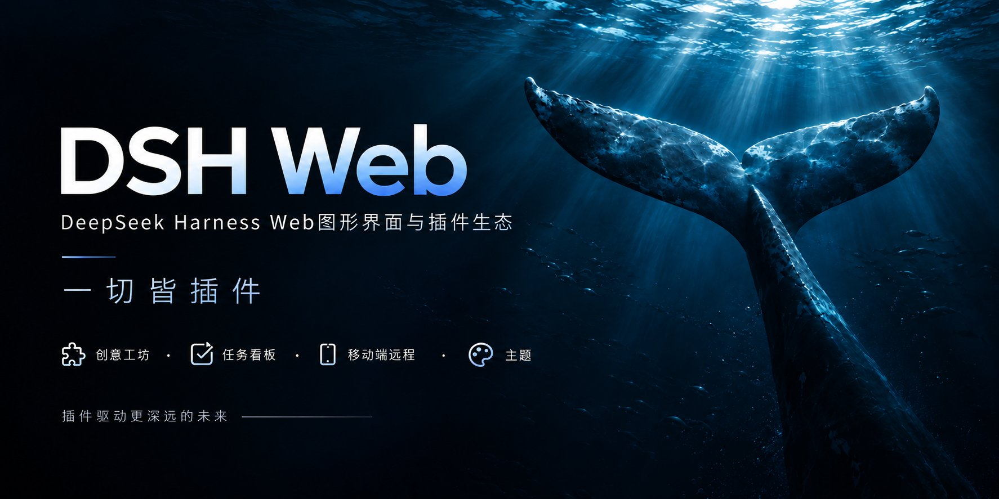

# dsh-web · DeepSeek Harness Web GUI 插件与主题

中文 | [English](README.en.md)

dsh-web 是面向 DeepSeek Harness（DSH）Web GUI 的模块化插件生态与桌面工作台，为 AI 智能体开发提供任务自动化看板、手机与跨设备远程控制、SSH 终端运维、Git 历史可视化以及个性化主题皮肤。用户既可以通过官方 profile 机制将插件全家桶一键挂载至已有的 `dsh web` 实例，也可以直接下载内置完整 Node.js 运行时与全套插件的 macOS 与 Windows 桌面客户端 DSH Desktop。

<p align="center">
  
</p>

<p align="center">
  
  &nbsp;
  
  &nbsp;
  
  &nbsp;
  <a href="https://www.npmjs.com/package/@linxin666/dsh-web-all"></a>
  &nbsp;
  <a href="https://www.npmjs.com/package/@linxin666/dsh-web-all"></a>
  &nbsp;
  <a href="https://dshfind.com/zh/plugins/zhu1090093659/dsh-web?ref=badge"></a>
  &nbsp;
  <a href="https://dsh-market.com"></a>
  &nbsp;
  <a href="https://www.npmjs.com/package/@deepseek-ai/dsh"></a>
  &nbsp;
  
</p>

<p align="center">
  <strong>DeepSeek Harness（DSH）Web 插件生态 · 模块化智能体工作台</strong><br>
  <em>创意工坊 · 任务看板 · 移动端远程 · SSH 运维 · Git 图谱 · 使用统计</em>
</p>

<div align="center">

[是什么](#是什么) · [DSH Desktop](#dsh-desktop桌面客户端) · [创意工坊](#创意工坊dsh-marketcom) · [功能插件](#功能插件) · [皮肤](#皮肤) · [快速上手](#快速上手) · [常见问题](#常见问题) · [已知限制](#已知限制) · [社区](#社区)

</div>

## 是什么

原生 DeepSeek Harness Web 提供了核心的对话交互与工具调用能力，但在多任务并发调度、长程后台执行、移动端协同以及工程化开发运维方面仍有扩展空间。

dsh-web 通过官方 profile 机制挂载到 `dsh web`，零修改侵入官方源码，为用户提供完整的模块化扩展体系：
- **工程运维与协同插件**：涵盖长程定时任务看板、移动端与跨设备远程控制、SSH 终端传输、Git 图谱与 worktree 隔离、全量会话归档管理、模型能力声明编辑器以及资源管理器右侧面板；
- **视觉主题与资产解耦**：功能插件与样式资产完全分离。皮肤插件负责底层渲染，多样化的主题皮肤（含样式、贴图与动态特效）以及桌面宠物可通过 [DSH 创意工坊](#创意工坊dsh-marketcom)自由安装；
- **全家桶聚合与按需组合**：既支持通过 `@linxin666/dsh-web-all` 聚合包一键安装完整功能，也支持按需单独安装特定插件。聚合包预集成家族全部功能插件；alpha 分支不内置 `dsh-better-sidebar` 等外部插件，按需安装，详见[插件全家桶使用指南](packages/dsh-web-all/README.zh.md)。


| 能力 | 原生 dsh web | dsh-web 全家桶 |
| --- | --- | --- |
| Agent 预设 | 官方预设（Standard / Minimal 等） | 官方与社区预设 |
| 自定义模型能力 | 无 | 逐模型声明图片输入与推理档位，并停用 / 启用自定义供应商 |
| 任务看板 | 无 | 多列看板 + cron 定时真实执行 |
| 移动端远程 | 无 | 扫码配对、SSE 实时同步；同一链接也可配对 PC 浏览器 |
| 远程服务器运维 | 无 | SSH 面板：终端 / 传输 / 隧道 / 集群 |
| 使用统计 | 无 | token 用量、供应商余额、套餐额度与 Token 银行 |
| 文件预览与变更 | 无 | 右侧面板：资源管理器 / 编辑器 / 终端 / Git / 浏览器 |
| Git 可视化 | 无 | 分支选择器 + 提交历史图谱 |
| 会话归档 | 无 | 集中查看与筛选全部会话，批量归档 / 恢复 / 删除，含自动策略 |
| 主题皮肤 | 默认主题 | Blue Fantasy 随皮肤插件内置，其他皮肤从创意工坊按需安装 |

### 按使用场景选择 DSH 扩展

| 使用场景 | 快速入口 |
| --- | --- |
| 执行和定时调度 AI 智能体任务 | [任务看板与 cron 定时执行](packages/dsh-task-board/README.zh.md) |
| 用手机或另一台电脑访问 DSH | [手机与 PC 浏览器远程控制](packages/dsh-remote-web-ui/README.zh.md) |
| 通过 SSH 管理远程服务器 | [SSH 终端、文件传输与隧道](packages/dsh-ssh/README.zh.md) |
| 自定义主题皮肤与宠物 | [浏览 DSH 创意工坊](https://dsh-market.com) |
| 使用 macOS 或 Windows 桌面应用 | [DSH Desktop 下载与使用要求](#dsh-desktop桌面客户端) |
| 为已有 DSH 安装插件全家桶 | [插件安装快速上手](#快速上手) |

## DSH Desktop（桌面客户端）

DSH Desktop 将 DeepSeek Harness Web GUI 封装为跨平台桌面应用（支持 macOS 与 Windows）。安装包内置独立的 Node.js 运行时环境（包含 npm 与 pnpm）、dsh 宿主以及预配置的 web profile（官方 web bundle 与 dsh-web 全家桶），无需预先配置系统开发环境或单独安装 dsh CLI。安装包随每个 [Release](https://github.com/zhu1090093659/dsh-web/releases) 的 `dsh-desktop-*` 资产发布（提供 macOS dmg/zip 与 Windows exe/zip）。

- **独立宿主与端口隔离**：内置运行时在 3082-3181 端口段启动专属 dsh 宿主，与原生 `dsh web` 的 3080/3081 端口完全隔离。桌面应用与独立命令行实例可并行运行，各自维护独立会话。
- **共享数据目录**：与 dsh CLI 共用 `~/.dsh` 配置目录（包含全局配置、历史会话与密钥）；应用自动初始化的 profile 带有标识，在内置运行时升级时会自动重新部署并保留用户的自定义 patch 层，不改动用户自建的 profile。
- **内置插件管理**：应用直接将 `dsh plugin add/remove` 命令转发给内置 pnpm 执行，增删插件无需额外配置外部开发工具链。
- **启动诊断与容错**：若遇到组件缺失、宿主异常退出或启动超时，界面将自动进入诊断错误页并输出宿主日志末尾，支持一键重试或直接定位日志文件。

安装包目前未做商业代码签名。macOS 首次运行如遇安全提示，可通过“右键菜单 → 打开”启动；Windows 系统弹出 SmartScreen 提示时，选择“更多信息 → 仍要运行”。详细构建步骤、配置说明与安全规范见 [desktop README](desktop/README.zh.md)。

## 创意工坊（dsh-market.com）

[创意工坊](https://dsh-market.com) 是 DSH 生态的一站式资产分发平台，统一提供主题皮肤、桌面宠物、功能插件与社区 Agent 预设。所有项目按照真实设备点赞热度排序，皮肤支持即时试穿预览，插件提供一键安装命令。经典的 Blue Fantasy 蓝色幻想随皮肤插件内置，其余主题皮肤与宠物资产均可在工坊浏览、查看源代码并按需安装。在 Web GUI 的“创意工坊”设置卡中可直接浏览线上清单，皮肤与宠物可一键下载至 DSH 主目录并在对应设置页选用；社区预设下载至本地预设库，启用后即可在“设置 → Agent 预设”中用于新建会话。


创意工坊站点为本仓库的组成部分：前端为纯静态构建，由构建脚本 `scripts/market-build` 依据 `skin.json`、`pet.json` 与 `community.json` 等数据源自动生成；点赞等动态能力由 Cloudflare Workers 边缘函数与 D1 数据库提供支持（遵循单设备单票限制），代码合入 `main` 分支后自动触发持续集成部署。

创意工坊旨在建立开放透明的社区生态，方便开发者分享作品并让用户自由选择所需扩展。

## 功能插件

### 任务看板（Task Board）

通过侧边栏“任务看板”进入。任务看板按待规划、待办、进行中、已完成、已失败五列呈现。点击卡片上的“执行”即可调用真实 DSH 智能体会话运行任务，执行完成后状态自动回写看板；点击卡片可随时跳转至对应会话回溯完整交互轨迹。

任务支持后端定时调度：在任务详情中配置 cron 表达式（例如每日 23:00 自动检查升级 DSH、每周一 09:00 生成周报），关闭浏览器后宿主进程仍会按计划触发执行并保存结果。任务看板提供可选的防休眠电源管理设置，支持 Windows、macOS 与带有 systemd-logind 的 Linux 系统，允许显示器息屏的同时防止整机因闲置进入睡眠状态（该设置默认处于关闭状态）。

任务支持会话复用模式：开启后若前一轮执行生成的会话仍存活且处于空闲状态，宿主将复用该会话继续运行后续任务（重新应用该任务指定的权限与模型，保留上下文历史）；若会话已关闭则自动新建会话，保证定时调度持续运转。

| 多列看板 | 定时执行 |
| --- | --- |
|  |  |

### 移动端远程控制（Mobile Remote）

通过侧边栏底部的手机图标打开设备配对面板。使用手机扫码或复制链接配对后，手机浏览器将直接载入官方 Web GUI，并自动激活移动端触控交互层：轻触鲸鱼图标唤出侧边栏、支持手势左滑收起与右滑展开、长按会话项目呼出操作菜单、软键盘 Enter 键仅用于换行、输入框采用 16px 字体防止页面聚焦缩放。适合桌面屏幕的扩展面板（如 SSH 终端、任务看板、Git 图谱等）在手机端自动隐藏，聚焦于会话管理、模型切换、思考强度调整与消息收发，多端实时共享完整上下文状态。

同一配对通道同样支持另一台 PC 浏览器接入：在远程电脑访问配对链接即可运行完整的桌面版 Web GUI。所有远程通信均受配对门控保护（走 `/remote/api` 路径），未经验证的访问将被拦截并仅显示提示横幅。配对令牌具备单次使用与超时失效机制，点击“停止”可立即吊销所有已连接设备。二维码默认基于局域网通信，搭配 cloudflared 等隧道工具可实现安全的公网跨网络访问。为确保安全性，使用隧道时建议走配对通道，不建议为隧道域名配置 `--trusted-host` 参数，避免绕过设备验证门控（详见[远程控制插件说明](packages/dsh-remote-web-ui/README.zh.md)）。


> **实时消息与隧道**：移动端基于 SSE（Server-Sent Events）接收实时流式消息。Cloudflare quick tunnel（trycloudflare.com）和 Tailscale Serve 默认不透传 SSE，此类网络环境下插件会自动降级为高频轮询，收发消息正常进行，新消息可能略有延迟。若需要即时流式推送，建议使用支持长连接与 SSE 的隧道服务（如 Cloudflare named tunnel 或自建 TCP 端口转发）。

| 移动端主页（鲸鱼入口） | 会话列表 |
| --- | --- |
|  |  |
| 聊天（思考与工具调用） | 模型选择（底部弹层） |
|  |  |

### 远程连接（SSH Ops）

通过侧边栏“SSH”入口打开远程运维面板。支持密钥与密码认证，可一键导入本地 `~/.ssh/config` 主机列表；配置数据安全保存在 `~/.dsh/dsh-ssh.json` 中。面板提供以下操作能力：

- **Web 终端**：基于 xterm.js 的完整远程交互终端，支持实时输出与窗口自适应；
- **文件传输**：集成 SFTP 上传与下载功能，提供进度提示并支持可视化浏览远程目录；
- **端口转发**：支持建立本地到远程内部服务的加密隧道（如内网数据库、后端 API），默认仅监听 127.0.0.1 安全地址；
- **集群并发执行**：支持多主机批量命令执行，并可通过别名、运行环境或标签进行过滤；
- **Agent 直连调用**：智能体与面板共享主机配置，在会话中发出指令即可委派 Agent 执行远程巡检与运维命令。

### 使用统计（Usage Statistics）

在“设置 > 使用统计”中集中查看 token 消耗数据、供应商余额以及编程套餐额度，支持自动定时刷新与手动即时查询。

- **用量明细**：查看每日输入、输出与缓存用量，按不同供应商与模型细分展示，并提供最近 30 天消费趋势；支持的供应商提供账户余额查询，针对 DeepSeek 官方路由还提供峰谷分时计费与账单估算。
- **个人套餐追踪**：实时展示 Kimi、GLM、MiniMax、OpenCode Go、Codex / ChatGPT 等平台编程套餐的使用比例与重置周期。
- **Token 银行**：DeepSeek 官方通道每消耗 1 token 自动积累 1 鲸元，以“鲸元券”形式展示台账周期内的累计调用指标，支持保存票券卡片与系统级分享。
- **桌面宠物联动**：安装宠物插件后，可通过桌面悬浮挂件的气泡提示直接查看当前会话供应商的额度、余额或今日消耗。

统计自插件首次启用起计，不回填历史数据；鲸元券仅统计台账窗口内的 DeepSeek 官方消耗。支持的供应商列表与配置细节见 [dsh-usage README](packages/dsh-usage/README.zh.md)。


### 模型能力（Model Capabilities）

自定义供应商的模型特性配置直接集成于“设置 > 模型”页面。针对官方界面未开放编辑的模型能力字段，本插件提供了可视化的配置编辑器：

- **图片输入能力声明**：在自定义供应商卡片内展开“模型能力”面板，可逐个模型明确声明是否支持图片输入（`["text","image"]` 或 `["text"]`），界面直观展示生效状态；
- **推理与思考档位配置**：支持声明为非推理模型（界面将隐藏思考强度滑块）、继承全局配置，或为模型定制具体的推理强度档位及底层请求参数；
- **即时生效与冲突保护**：配置复用官方存储通道，未编辑的字段保持原样，修改保存后即刻生效且无需重启服务；每次写入附带配置版本校验，避免多端并发修改引发覆盖；
- **供应商一键停用与启用**：支持临时禁用某供应商路由并自动归档配置，模型选择器将即时下线该供应商，保存的 API 密钥与凭据全程不受影响，后续可随时一键恢复。

*技术提示：该配置属于客户端向网关发送的协议声明，系统不执行自动化远端探测。若模型声明支持图片但供应商网关接口不支持多模态，请求阶段仍会由网关返回错误。详见 [dsh-model-capabilities README](packages/dsh-model-capabilities/README.zh.md)。*

### 右侧面板（Right Panel）

右侧面板由社区插件 [dsh-better-sidebar](https://github.com/omdsh-dev/DSH-better-sidebar) 提供，集成了文件资源管理器、内联代码编辑器、辅助终端、Git 面板以及内置网页浏览器，支持第三方插件注册停靠。alpha 分支的聚合包不内置它（其 0.19.1 的 peer 区间 `^0.1.5-rc.1` 不覆盖本分支的 0.1.7-alpha.1 cohort），按需安装：`dsh plugin --profile web add dsh-better-sidebar@latest`。相关架构与配置见其 [项目说明](https://github.com/omdsh-dev/DSH-better-sidebar)。


### Git 图谱（Git Graph）

在对话输入框上方集成 Git 操作栏与可视化提交历史图谱：

- **分支与提交图谱**：直观展示分支分叉与合并泳道，便于在大中型项目中快速追溯代码演进与切换分支。
- **Git Worktree 隔离会话**：多 Agent 并发处理任务时，直接在主分支修改容易导致文件冲突与分支污染。插件支持在 `$DSH_HOME/worktrees/` 目录下为新会话建立完全独立的 worktree 检出与隔离分支（命名形如 `wt/<名称>`），主检出文件保持干净；通过“管理 worktree”面板可集中查看与清理临时检出。
- **自动化策略与 Agent 集成**：提供“自动隔离”选项，为进入 Git 仓库的新会话自动分配专属 worktree；同时向智能体暴露 `git_worktree` 工具，允许 Agent 自主创建与管理隔离开发环境。

| Git 图谱 | Git worktree 并行会话 |
| --- | --- |
|  |  |

### 会话归档管理（Session Archive Manager）

会话归档管理（`dsh-session-archive`）是专为解决大量长短期会话堆积而设计的集中管理模块，随全家桶安装生效：

- **集中检索与状态筛选**：统一呈现活跃会话、已归档会话、空白会话、子代理派生会话以及无工作区会话，支持按标题、工作区、状态及会话 ID 进行关键词搜索与多维排序；
- **安全批量操作**：支持跨筛选结果的多选批量归档、批量恢复以及级联物理删除。执行物理删除时系统将明确提示受影响的后代会话数与预计释放空间，大批量删除需二次确认；当前处于运行中或带有运行中子代理的会话受到严格保护，防止误删；
- **自动化生命周期策略**：提供两个默认关闭的自动化策略：根据最后活跃时间自动归档、根据归档时间自动清理超期数据，支持在启用前进行结果预览与单次手动执行。

删除操作不可逆，所有管理路由严格限制本机回环访问。详细机制见 [dsh-session-archive README](packages/dsh-session-archive/README.zh.md)。

### 更多插件（More Plugins）

- **Skill 中心**（`dsh-client-ui-skill-explorer`）：按来源集中查看与管理已加载的 agent skills，支持按名称与功能描述实时搜索过滤，多工作区独立呈现，支持一键启停与删除。
- **插件管理器**（`dsh-client-ui-plugin-manager`）：基于官方 host 接口从 npm 或 git 仓库直接安装插件，可视化管理插件运行状态与自定义配置。

### 皮肤

经典的 Blue Fantasy 蓝色幻想是随皮肤插件内置的默认主题：深邃的靛蓝色调贯穿全局，搭配半透明毛玻璃面板与定制鲸鱼插画，在暗色模式下具有优秀的视觉沉浸感。其他精美皮肤与 Wallpaper Engine 动态壁纸由皮肤插件统一管理，可直接在[创意工坊](https://dsh-market.com)在线预览、试穿与一键安装。


## 快速上手

### 系统要求

- 已安装 DeepSeek Harness 且 `dsh web` 可正常启动。
- npm 安装方式无需额外环境；若从源码仓库构建，需要 Node.js >= 22 与 pnpm 环境。

### 三步上手（npm 安装，推荐）

- **DSH Web CLI（现有浏览器服务）**：
  1. 安装聚合包：`dsh plugin --profile web add @linxin666/dsh-web-all@latest`
  2. 重启 `dsh web` 服务，侧边栏将自动呈现各插件入口
  3. 打开“设置 > 插件配置”按需开关插件，或在皮肤面板选用主题
- **DSH Desktop（桌面客户端）**：
  1. 从 [Releases](https://github.com/zhu1090093659/dsh-web/releases) 下载对应系统的 `dsh-desktop-*` 安装包（macOS dmg/zip、Windows exe/zip）
  2. 安装并启动应用：内置运行时与全家桶已随安装包就绪，无需配置额外环境
  3. 通过应用内置的插件管理器或设置面板管理扩展与主题

> 若仅需要皮肤功能，可单独安装 `@linxin666/dsh-client-ui-skin-center`。若因包管理器门禁安装到旧版本，请参阅后文“安装排障”。

### 从 GitHub 仓库直接安装

仓库根目录声明了标准 `dsh.bundle` 装配清单，支持直接通过仓库地址安装，无需手动克隆代码与构建：

```sh
dsh plugin --profile web add github:zhu1090093659/dsh-web
# 或使用完整 git 地址：dsh plugin --profile web add git+https://github.com/zhu1090093659/dsh-web.git
```

该方式与直接从 npm 安装聚合包效果等价，二者择其一即可。请勿同时通过两种方式安装，以免出现 entry id 冲突。

### 从仓库安装（开发调试）

如需二次开发或调试插件，可按以下步骤从源码构建（要求 Node.js >= 22 与 pnpm）：

```sh
# 1. 克隆源码仓库
git clone https://github.com/zhu1090093659/dsh-web.git
cd dsh-web

# 2. 安装项目依赖并构建全包
pnpm install
pnpm -r build

# 3. 将本地包软链挂载至 web profile（建议先链接所有子包再注册聚合包）
node scripts/link-profile.mjs
dsh plugin --profile web add link:$(pwd)/packages/dsh-web-all

# 4. 重新启动 dsh web 服务
dsh web
```

> 提示：profile 目录未配置为 pnpm workspace，聚合包内部的 `workspace:*` 依赖在解析时会尝试回退拉取 npm 线上版本。若线上包存在版本差异，请先运行 `node scripts/link-profile.mjs` 确保全部子包均指向本地构建产物。

### 从旧聚合包升级

若当前环境仍在使用旧版聚合包 `@linxin666/dsh-web-ui-all`，插件管理器的更新检测机制会自动将该项标记为迁移通道（`@linxin666/dsh-web-ui-all` → `@linxin666/dsh-web-all`）。点击更新即可自动执行事务迁移：系统会按原有 bundle 顺序安全替换为新包，并在执行完成后使用 `--dump-config` 进行预检，任一步骤异常均会自动回滚。

### 单独安装某个插件

如果不需要安装全家桶，可根据实际需求单独安装各个功能模块：

```sh
dsh plugin --profile web add @linxin666/dsh-client-ui-task-board@latest              # 任务看板
dsh plugin --profile web add @linxin666/dsh-ssh@latest                             # 远程连接（SSH）
dsh plugin --profile web add @linxin666/dsh-usage@latest                           # 使用统计
dsh plugin --profile web add @linxin666/dsh-client-ui-model-capabilities@latest    # 模型能力声明
dsh plugin --profile web add @linxin666/dsh-pet@latest                             # 桌面悬浮宠物
dsh plugin --profile web add @linxin666/dsh-session-archive@latest                 # 会话归档管理
dsh plugin --profile web add dsh-better-sidebar@latest                             # 右侧辅助面板（alpha 分支未内置）
```

<details>
<summary><strong>全部 npm 包一览</strong></summary>

所有插件均以 `@linxin666/dsh-*` 命名空间公开发布于 npm：

| npm 包名 | 功能说明 |
| --- | --- |
| [@linxin666/dsh-web-all](https://www.npmjs.com/package/@linxin666/dsh-web-all) | 全家桶聚合包：一站式包含全部功能插件与皮肤中心 |
| [@linxin666/dsh-client-ui-task-board](https://www.npmjs.com/package/@linxin666/dsh-client-ui-task-board) | 任务看板：支持长程异步任务与 cron 定时调度 |
| [@linxin666/dsh-remote-web-ui](https://www.npmjs.com/package/@linxin666/dsh-remote-web-ui) | 移动端远程控制：扫码配对、跨设备协同与触控优化 |
| [@linxin666/dsh-ssh](https://www.npmjs.com/package/@linxin666/dsh-ssh) | 远程运维面板：Web 终端、SFTP 传输、端口转发与集群执行 |
| [@linxin666/dsh-usage](https://www.npmjs.com/package/@linxin666/dsh-usage) | 用量统计：Token 消耗、余额估算、套餐追踪与 Token 银行 |
| [@linxin666/dsh-client-ui-model-capabilities](https://www.npmjs.com/package/@linxin666/dsh-client-ui-model-capabilities) | 模型能力：自定义供应商图片输入声明与推理档位配置 |
| [@linxin666/dsh-pet](https://www.npmjs.com/package/@linxin666/dsh-pet) | 桌面宠物：注册表驱动的桌面交互悬浮挂件 |
| [@linxin666/dsh-client-ui-git-graph](https://www.npmjs.com/package/@linxin666/dsh-client-ui-git-graph) | Git 图谱：可视化提交历史、分支流与 worktree 隔离 |
| [@linxin666/dsh-client-ui-skin-center](https://www.npmjs.com/package/@linxin666/dsh-client-ui-skin-center) | 皮肤中心：主题与壁纸的加载与运行引擎 |
| [@linxin666/dsh-client-ui-market](https://www.npmjs.com/package/@linxin666/dsh-client-ui-market) | 创意工坊客户端：线上资产一键下载与管理 |
| [@linxin666/dsh-client-ui-preset-center](https://www.npmjs.com/package/@linxin666/dsh-client-ui-preset-center) | 预设中心：社区 Agent 预设安装与管理 |
| [@linxin666/dsh-client-ui-plugin-manager](https://www.npmjs.com/package/@linxin666/dsh-client-ui-plugin-manager) | 插件管理器：可视化插件状态控制与配置编辑 |
| [@linxin666/dsh-client-ui-skill-explorer](https://www.npmjs.com/package/@linxin666/dsh-client-ui-skill-explorer) | Skill 中心：已加载技能的浏览、检索与管理 |
| [@linxin666/dsh-session-archive](https://www.npmjs.com/package/@linxin666/dsh-session-archive) | 会话归档：全量会话检索、批量恢复与级联清理 |
| [@linxin666/dsh-client-ui-community-plugins](https://www.npmjs.com/package/@linxin666/dsh-client-ui-community-plugins) | 社区数据源：创意工坊插件目录权威清单 |
| [@linxin666/dsh-client-ui-web-ui-settings](https://www.npmjs.com/package/@linxin666/dsh-client-ui-web-ui-settings) | 综合设置面板：dsh-web 全局偏好与样式配置 |

</details>

### 验证与卸载

安装后重启 `dsh web` 服务，侧边栏出现对应功能图标即代表加载成功；亦可通过执行 `dsh --profile web --dump-config` 检查配置层挂载状态。若侧边栏未刷新出入口，请确认服务进程已彻底重启。

卸载聚合包：`dsh plugin --profile web remove @linxin666/dsh-web-all`，完成后重启 `dsh web` 即可恢复纯净状态。

技术实现细节与挂载原理解析见 [docs/plugins.md](docs/plugins.md)。

### 安装排障

<details>
<summary><strong>展开查看常见安装与构建排障方案</strong></summary>

<br>

> **pnpm 严格依赖隔离导致模块找不到**：pnpm 的 isolated 模式默认仅将聚合包放置在顶层，部分子包可能被嵌套收敛，导致 `dsh web` 启动时报错 `Cannot find package '@linxin666/dsh-...'`。若遇到此情况，可在 profile 目录的 `pnpm-workspace.yaml` 中添加配置 `nodeLinker: hoisted`（或 `public-hoist-pattern: ['@linxin666/*']`）后重新安装。

> **构建脚本被拦截 (ERR_PNPM_IGNORED_BUILDS)**：首次安装时若提示第三方包的构建脚本被拦截，可根据终端指引将 `cloudflared`、`cpu-features` 以及 `ssh2` 加入 profile 所在 `pnpm-workspace.yaml` 的 `allowBuilds` 列表中。

> **pnpm 11 发布时间门禁问题**：在包版本发布后的短时间内，pnpm 11 的默认安全策略（`minimumReleaseAge`）可能会尝试回退拉取旧版本。建议在 profile 目录的 `pnpm-workspace.yaml` 中排除相关命名空间以确保获取最新版本：
>
> ```yaml
> minimumReleaseAgeExclude:
>   - '@linxin666/*'
> ```

</details>

## 常见问题

<details>
<summary><strong>安装重启后，侧边栏未显示插件入口？</strong></summary>

请首先检查插件是否正确安装至 `web` profile（命令需包含 `--profile web`），并通过 `dsh --profile web --dump-config` 验证配置层是否已成功挂载。注意仅刷新网页无法加载新模块，必须彻底重启 `dsh web` 后端服务进程。

</details>

<details>
<summary><strong>定时任务为何未能按时触发执行？</strong></summary>

任务调度完全由 `dsh web` 后端宿主进程驱动，无需保持前端浏览器页面打开。若宿主进程退出、系统关机或整机进入深度睡眠，错过的触发时间点将遵循跳过策略处理，不执行回填补跑；若任务到达触发点时上一轮仍在运行，会自动顺延至下一个周期。若需要允许息屏但防止主机自动睡眠，可开启任务看板自带的电源保护选项。

</details>

<details>
<summary><strong>手机端配对后为何没有收到流式推送？</strong></summary>

移动端流式传输依赖 SSE 通道。Cloudflare quick tunnel 与 Tailscale Serve 服务默认不转发 SSE 长连接，在此类网络下插件会自动切换为短轮询模式，消息收发功能正常但更新稍有间隔。若需获得平滑的实时流式体验，请搭配支持长连接的隧道方案（如 Cloudflare named tunnel 或自建 TCP 反向代理）。

</details>

<details>
<summary><strong>试穿主题皮肤不满意如何还原？</strong></summary>

皮肤面板提供免落盘试穿功能：点击试穿即刻在当前界面生效预览，离开面板或关闭预览会自动恢复初始外观；只有显式点击“应用”按钮才会将主题配置写入磁盘，可放心预览各类主题。

</details>

<details>
<summary><strong>是否可以仅使用主题皮肤或某个单一插件？</strong></summary>

完全支持。若仅需要视觉定制，直接安装 `@linxin666/dsh-client-ui-skin-center` 即可；若仅需特定功能，参考“单独安装某个插件”章节直接安装对应 npm 包即可。

</details>

<details>
<summary><strong>已安装全家桶的前提下，能否额外独立安装某个子插件？</strong></summary>

可以。聚合包内部的插件注册标识均统一带有 `web-ui-` 前缀（例如 `web-ui-usage`），与独立包的原生标识（如 `usage`）相互独立，不会产生 loader entry 重复冲突。宿主服务对同类插件会自动去重。通常情况下安装全家桶即可满足完整需求，无需重复安装单个子包。

</details>

## 已知限制

- 任务看板由后端 Host 进程统一调度，关闭前端标签页不影响任务执行；但若宿主进程停止或操作系统关机睡眠，处于离线期间的触发点将直接跳过不补跑。可选的电源保护仅阻止系统闲置睡眠，无法阻止用户主动合盖、手动休眠或电源切断，技术细节见 [dsh-task-board README](packages/dsh-task-board/README.zh.md)。
- SSH 凭据（密码与私钥口令）保存在本地 `~/.dsh/dsh-ssh.json` 文件中（文件权限为 0600）；在网络中断重连时可能重新发送非幂等命令，终端输出保持原样返回不执行脱敏，安全规范见 [dsh-ssh README](packages/dsh-ssh/README.zh.md)。
- 移动端基于 SSE 实现流式推送：在不支持 SSE 透传的代理或免费隧道下会自动降级为轮询，消息更新存在秒级延迟。
- 从源码构建全仓需要 Node.js >= 22 与 pnpm 工具链，直接从 npm 安装不受此限制。

## 社区

欢迎加入社区交流群，与开发者及其他用户探讨使用技巧、反馈使用问题或提出新功能建议。

扫描下方二维码加入“DSH Web UI 交流群”：


也可以通过 [Discord 社区](https://discord.gg/6v4gm9u4S) 进行交流，或前往 [GitHub Issues](https://github.com/zhu1090093659/dsh-web/issues) 提交缺陷报告与功能需求。

<details>
<summary>友情链接</summary>

- [DeepSeek Harness Desktop](https://github.com/anywhere-labs/deepseek-harness-desktop) —— 为 DeepSeek Harness (DSH) 生态打造的现代化桌面端体验。
- [LINUX DO](https://linux.do) —— 有理想的新社区。
- [dshfind](https://dshfind.com) —— 面向 DeepSeek Harness 的学习与分享社区，聚合论文精读、插件超市与用户排名。
- [deepseek-plugin-store](https://github.com/Ericwong5021/deepseek-plugin-store) —— DeepSeek Harness 独立社区插件商店，发现、安装并提交经过验证的插件、工具与扩展。
- [dsh-data-agent](https://github.com/omdsh-dev/dsh-data-agent) —— 为 DSH 定义专用 Data Agent 预设，让 AI 帮你查询、更新、分析数据。
- [dsh-TUI](https://github.com/ccch1mneyyy/dsh-TUI) —— Claude Code 风格全屏交互终端插件，补位官方缺失的终端 TUI：像素鲸鱼顶栏、实时工作状态行、思考流式展开、双击 Esc 回滚、上下文进度条与 TPS 仪表。
- [dsh-tianshu-tui](https://github.com/huiliyi37/dsh-tianshu-tui) —— 基于官方 DeepSeek Harness 的交互式终端 UI 插件，在官方基础上增加 TDD 与证据门等工作流。
- [dsh-genui](https://github.com/omdsh-dev/dsh-genui) —— 助手回复内联渲染生成式 UI（dsh-ui fence）：布局、图表、表格、表单、Mermaid、3D 与原生音视频，双通道渲染兼容原版 DSH 与新构建，支持流式渲染、面板停靠与组件交互回传模型。
- [dsh-annotation](https://github.com/omdsh-dev/dsh-annotation) —— DSH Web 选中批注插件：选文字、写批注、随消息发送，模型按 Annotation N 逐条对照回复；UI 与批注块跟随 DSH 语言切换 zh/en，Cmd/Ctrl+Enter 直发纯批注，斜杠命令原样放行。

</details>

## 参与贡献

- 提交代码前请查阅 [CONTRIBUTING.md](CONTRIBUTING.md)；涉及用户界面的修改请附带测试用例或验证截图；
- 提交信息严格遵循 Conventional Commits 规范（例如 `fix(task-board): 修复状态同步问题`），代码、文档与 commit 信息全程杜绝使用 emoji；
- 新建插件或皮肤请使用标准脚手架生成：`node scripts/dsh-plugin-new <name>`、`node scripts/dsh-skin-new`；
- 提交前请确保通过本地质量门禁：`pnpm typecheck && pnpm test && pnpm docs:check`；完整开发流程见 [docs/development.md](docs/development.md)。

## 许可证

本仓库采用 [Apache-2.0](LICENSE) 许可证授权。引入第三方代码必须严格保留原始 LICENSE 与作者署名；具有活跃上游的第三方项目优先以 npm 依赖或 fork 方式引入，避免直接复制代码。

### 来源与版权

<details>
<summary>第三方来源与版权登记（点击展开 · 插件 / 皮肤 / 宠物）</summary>

**插件**

- **dsh-task-board / dsh-git-graph / dsh-pet / dsh-remote-web-ui / dsh-web-settings / dsh-ssh / dsh-skill-explorer / dsh-market / dsh-plugin-manager / dsh-community-plugins / dsh-web-all** — 本仓库原创（zhu1090093659），Apache-2.0（zhu1090093659）
- **dsh-tool-describe-image** — 移植自 [whitelonng/dsh-plugin-describe-image](https://github.com/whitelonng/dsh-plugin-describe-image)（deepseek-harness `packages/vision/tool-describe-image`），Apache-2.0（zhu1090093659）
- **dsh-better-sidebar** — 外部集成插件 [omdsh-dev/DSH-better-sidebar](https://github.com/omdsh-dev/DSH-better-sidebar)（右侧面板，alpha 分支按需安装、非内置依赖），MIT（omdsh-dev）
- **dsh-ssh** — 依据 [badseal/ssh-skill](https://github.com/badseal/ssh-skill) 的能力清单实现；代码为本仓库 Apache-2.0（zhu1090093659），上游能力清单归属 badseal/ssh-skill
- **社区插件索引** — 37 项外部插件，来源与版权由各作者声明，登记于 [community.json](packages/dsh-community-plugins/community.json)，可在「设置 → 社区插件」与 dsh-market.com 查看

**皮肤（第三方作者或第三方素材）**

- **maid-atelier / orca-link** — [Small-tailqwq/dsh-deep-whale](https://github.com/Small-tailqwq/dsh-deep-whale)，CC BY-NC-SA 4.0；署名链见包内 LICENSE/NOTICE（maid：上善 → zipzip → Small-tailqwq；orca：上善 → Small-tailqwq）
- **phoebe-atelier** — [Theater-ahyeon/phoebe-atelier](https://github.com/Theater-ahyeon/phoebe-atelier)，CC BY-NC-SA 4.0；角色「菲比」版权属库洛游戏（Kuro Games，《鸣潮》），AI 辅助同人再创作仅供非商业使用（署名链见包内 LICENSE/NOTICE）
- **cyber-night** — logan0116；代码按仓库许可，背景图由作者以 OpenAI GPT 生成并按 CC0 1.0 贡献公有领域
- **future-window** — zhuqin；背景与装饰原件 Apache-2.0（包内 LICENSE/NOTICE，attribution 见 skin.json）
- **matrix** — 贡献者 seanchen 原创（Matrix 深夜护眼暗色皮肤），Apache-2.0（seanchen 声明）
- **blue-fantasy** — powerdog996（DreamSkin 社区）× dsh-web 适配；皮肤目录内未附第三方许可声明（待作者确认补声明）
- **whalechan-harness** — [online111111/whalechan-dsh-theme](https://github.com/online111111/whalechan-dsh-theme) 的 Whale-chan Theme contributors；角色方向参考 [Neko3000/deepseek-whalechan](https://github.com/Neko3000/deepseek-whalechan)，CC BY-NC-SA 4.0，完整署名与非官方声明见皮肤目录 LICENSE/NOTICE
- **deep-current** — Twelveeee；皮肤目录内未附许可声明（待作者确认补声明）
- **furina** — 立绘/角色素材 sclass53，皮肤代码 zhu1090093659（目录内 LICENSE 为 BSD-3-Clause）；角色「芙宁娜」版权属米哈游（《原神》），作为粉丝创作使用
- **harbor** — moeblack；皮肤目录内未附许可声明（待作者确认补声明）
- **miku** — 立绘素材 涂山苏苏，皮肤代码 zhu1090093659；角色「初音未来」版权属 Crypton Future Media, INC.（Piapro Character License）
- **pink-sakura** — 立绘素材 guomengjia618-dot，皮肤代码 zhu1090093659（目录内 LICENSE 为 Apache-2.0）
- **war-thunder** — 皮肤代码为本仓库（Apache-2.0）；背景美术与启动器星徽取文本机 War Thunder 游戏客户端，版权归 Gaijin Entertainment，仅供个人非商业使用（见 skin.json attribution）
- **blue-throated-bee-eater** — 皮肤代码为本仓库（dsh-web，Apache-2.0）；背景照片 Kriangsak Hongchumpae 摄（Wikimedia Commons，CC BY-SA 4.0，已缩放重压缩；许可与署名链见目录内 NOTICE 与 skin.json attribution）
- **whale-maid（鲸鱼娘·望海）** — 皮肤工程与两张背景插画、装饰 SVG 均为 stushansusu 原创；按 CC BY-NC-SA 4.0 发布（目录内 LICENSE，attribution 见 skin.json）

> 其余皮肤（mint / whale-song / whale-mom / dragon-heir / minecraft / trading / summer-liquid-glass / wallpaper-exclusive / xp）为本仓库原创，Apache-2.0。

**宠物**

- **ouo-neko** — Pessimist0906，MIT（贡献记录见 [PR #1118](https://github.com/zhu1090093659/dsh-web/pull/1118) 与 dsh-pet [THIRD_PARTY_NOTICES.md](packages/dsh-pet/THIRD_PARTY_NOTICES.md)）
- **whale / whale-refined** — 基于 DeepSeek wordmark 衍生的鲸鱼挂件（MIT / BSD-3-Clause；材料与声明见 dsh-pet THIRD_PARTY_NOTICES.md）
- **miku** — 立绘素材 涂山苏苏，MIT；角色「初音未来」的名称、形象与肖像权归 Crypton Future Media, INC.（Piapro Character License）
- **jyn（女仆鲸鱼娘）** — 11726，MIT（贡献记录见 [PR #1362](https://github.com/zhu1090093659/dsh-web/pull/1362)）
- **doro（朵拉）** — stushansusu，MIT（贡献记录见 [PR #1630](https://github.com/zhu1090093659/dsh-web/pull/1630)）；角色「doro」是《胜利女神：妮姬》桃乐丝（Dorothy）的非官方同人二创／梗衍生形象，角色及相关权利归 SHIFT UP 所有，素材仅限个人非商业使用，与官方无关（详见 [THIRD_PARTY_NOTICES.md](packages/dsh-pet/THIRD_PARTY_NOTICES.md)）
- **blue-throated-bee-eater（蓝喉蜂虎）** — 本仓库原创（dsh-web，Apache-2.0；贡献记录见 [PR #1402](https://github.com/zhu1090093659/dsh-web/pull/1402)）
- **starry-doll（星夜人偶）** — Theater-ahyeon，CC BY-NC-SA 4.0（仅限非商业使用）

</details>

## 贡献者

<!-- CONTRIBUTORS:START -->
<p align="center">
  <a href="https://github.com/zhu1090093659"></a>
  <a href="https://github.com/Aa728848"></a>
  <a href="https://github.com/stushansusu"></a>
  <a href="https://github.com/thinkmoon"></a>
  <a href="https://github.com/sharkymew"></a>
  <a href="https://github.com/Theater-ahyeon"></a>
  <a href="https://github.com/mkloveyy"></a>
  <a href="https://github.com/Nath-Vikky"></a>
  <a href="https://github.com/yezi4271"></a>
  <a href="https://github.com/whitelonng"></a>
  <a href="https://github.com/Qiuner"></a>
  <a href="https://github.com/guomengjia618-dot"></a>
  <a href="https://github.com/SnowNightt"></a>
  <a href="https://github.com/ch1bug"></a>
  <a href="https://github.com/suharvest"></a>
  <a href="https://github.com/chemmy-11"></a>
  <a href="https://github.com/wingsky-1"></a>
  <a href="https://github.com/Menghuan1918"></a>
  <a href="https://github.com/4evercool"></a>
  <a href="https://github.com/JiewiW"></a>
  <a href="https://github.com/Qinling-Melon-Farmers"></a>
  <a href="https://github.com/PerryLink"></a>
  <a href="https://github.com/isdoge"></a>
  <a href="https://github.com/Xeehho"></a>
  <a href="https://github.com/EricWang1358"></a>
  <a href="https://github.com/DDDMUC"></a>
  <a href="https://github.com/skymecode"></a>
  <a href="https://github.com/GreenLv"></a>
  <a href="https://github.com/oh-wang"></a>
  <a href="https://github.com/TiankunDai"></a>
  <a href="https://github.com/Small-tailqwq"></a>
  <a href="https://github.com/Grivn"></a>
  <a href="https://github.com/ads4395-prog"></a>
  <a href="https://github.com/matriox1003"></a>
  <a href="https://github.com/spacexun2"></a>
  <a href="https://github.com/xiaoyuyu6420"></a>
  <a href="https://github.com/z953218350"></a>
  <a href="https://github.com/guo6x"></a>
  <a href="https://github.com/LittleDarkZero"></a>
  <a href="https://github.com/xohmai"></a>
  <a href="https://github.com/YEYUbaka"></a>
  <a href="https://github.com/suyicon"></a>
  <a href="https://github.com/dickpy"></a>
  <a href="https://github.com/JsonFish"></a>
  <a href="https://github.com/Abyss-Seeker"></a>
  <a href="https://github.com/online111111"></a>
  <a href="https://github.com/Zacklinkk"></a>
  <a href="https://github.com/Noob-stupid"></a>
  <a href="https://github.com/weike-zhang"></a>
  <a href="https://github.com/BlessedWithLuck1105"></a>
  <a href="https://github.com/RevolutionLA"></a>
  <a href="https://github.com/Richard-Peng402"></a>
  <a href="https://github.com/liiydong"></a>
  <a href="https://github.com/logan0116"></a>
  <a href="https://github.com/nicecx"></a>
  <a href="https://github.com/nickkkkkk123123"></a>
  <a href="https://github.com/lpreterite"></a>
  <a href="https://github.com/Jamsharden"></a>
  <a href="https://github.com/neystan"></a>
  <a href="https://github.com/qzhqzh"></a>
  <a href="https://github.com/rainow"></a>
  <a href="https://github.com/rongxingda"></a>
  <a href="https://github.com/lemonmmice"></a>
  <a href="https://github.com/kyrie204"></a>
  <a href="https://github.com/kop022"></a>
  <a href="https://github.com/wang-kaopu"></a>
  <a href="https://github.com/dongwenxiu83-web"></a>
  <a href="https://github.com/heyizhiyuan"></a>
  <a href="https://github.com/ma15803216102"></a>
  <a href="https://github.com/Chimney"></a>
  <a href="https://github.com/viplocco"></a>
  <a href="https://github.com/activeing123"></a>
  <a href="https://github.com/Zhiyi-Zhao"></a>
  <a href="https://github.com/JAVA-LW"></a>
  <a href="https://github.com/AngleNaris"></a>
  <a href="https://github.com/ShiroEirin"></a>
  <a href="https://github.com/zxkk97984-creator"></a>
  <a href="https://github.com/yiyueawa"></a>
  <a href="https://github.com/wertyq111"></a>
  <a href="https://github.com/zbsph"></a>
  <a href="https://github.com/yufengnigel"></a>
  <a href="https://github.com/yongshuai0314"></a>
  <a href="https://github.com/yindf"></a>
  <a href="https://github.com/xiaobin"></a>
  <a href="https://github.com/wszhoho"></a>
  <a href="https://github.com/wsy222"></a>
  <a href="https://github.com/wig123"></a>
  <a href="https://github.com/v833"></a>
  <a href="https://github.com/user-A100"></a>
  <a href="https://github.com/tr1v3r"></a>
  <a href="https://github.com/starryrbs"></a>
  <a href="https://github.com/SnowCrescenter-tech"></a>
  <a href="https://github.com/slywalker2006"></a>
  <a href="https://github.com/Sivan757"></a>
  <a href="https://github.com/sclass53"></a>
  <a href="https://github.com/PcHeN0720"></a>
  <a href="https://github.com/OctKwong30"></a>
  <a href="https://github.com/Nwflower"></a>
  <a href="https://github.com/Moeblack"></a>
  <a href="https://github.com/Lem0nTea2002"></a>
  <a href="https://github.com/LHMQ878"></a>
  <a href="https://github.com/jcaiagent7143-ui"></a>
  <a href="https://github.com/JUANWANG-BUAA"></a>
  <a href="https://github.com/Izgenlre"></a>
  <a href="https://github.com/NuCl34R"></a>
  <a href="https://github.com/HAN102300"></a>
  <a href="https://github.com/superman32432432"></a>
  <a href="https://github.com/FoolishWiser"></a>
  <a href="https://github.com/farobute"></a>
  <a href="https://github.com/DavidWanm"></a>
  <a href="https://github.com/DamonKoy"></a>
  <a href="https://github.com/aexachao"></a>
  <a href="https://github.com/ch3n4y"></a>
  <a href="https://github.com/Beverly621"></a>
  <a href="https://github.com/AmethystLuna"></a>
  <a href="https://github.com/AlfredChaos"></a>
  <a href="https://github.com/Aik358"></a>
  <a href="https://github.com/liaoyonghong"></a>
  <a href="https://github.com/YeqingTang"></a>
  <a href="https://github.com/cncolder"></a>
  <a href="https://github.com/great-man2096"></a>
  <a href="https://github.com/Starfie1d1272"></a>
  <a href="https://github.com/WyxBUPT-22"></a>
  <a href="https://github.com/Wike-CHI"></a>
  <a href="https://github.com/CCMKCCMK"></a>
  <a href="https://github.com/wanpan11"></a>
  <a href="https://github.com/Walvez"></a>
  <a href="https://github.com/Volta-ln"></a>
  <a href="https://github.com/UnusWhite"></a>
  <a href="https://github.com/Ultronen"></a>
  <a href="https://github.com/Twelveeee"></a>
  <a href="https://github.com/Tinger-X"></a>
  <a href="https://github.com/mrSutivu"></a>
  <a href="https://github.com/Signalight"></a>
  <a href="https://github.com/Scotlight"></a>
  <a href="https://github.com/NikolaFC"></a>
  <a href="https://github.com/RINGOLINK"></a>
  <a href="https://github.com/QIU0826"></a>
</p>
<p align="center">
  <sub><a href="https://github.com/zhu1090093659/dsh-web/graphs/contributors">查看全部贡献者</a></sub>
</p>
<!-- CONTRIBUTORS:END -->

<div align="center">

**喜欢这个项目？点个 Star。**

[报告 Bug](https://github.com/zhu1090093659/dsh-web/issues) · [请求功能](https://github.com/zhu1090093659/dsh-web/issues) · [查看 Releases](https://github.com/zhu1090093659/dsh-web/releases)

</div>

## 赞助支持

感谢每一位使用、反馈和贡献 dsh-web 的朋友。如果这个项目对你有帮助，欢迎扫码赞助，支持项目持续维护与发展：

<p align="center">
  
</p>