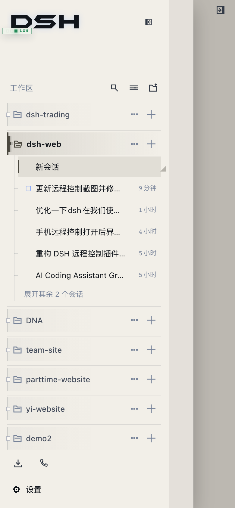
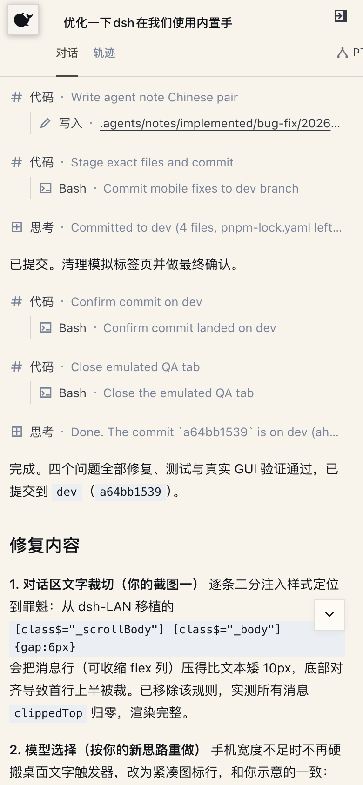
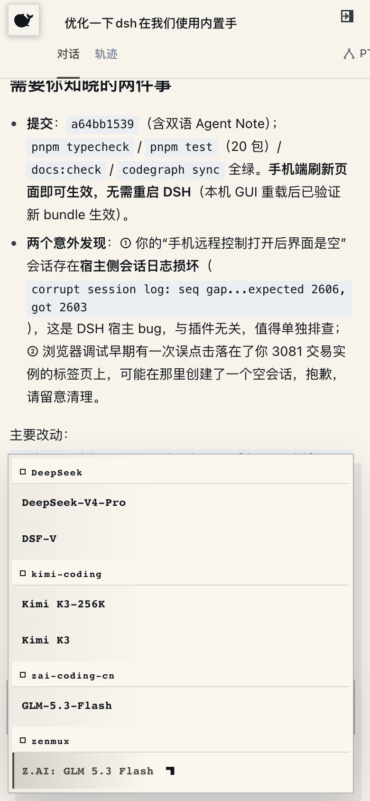
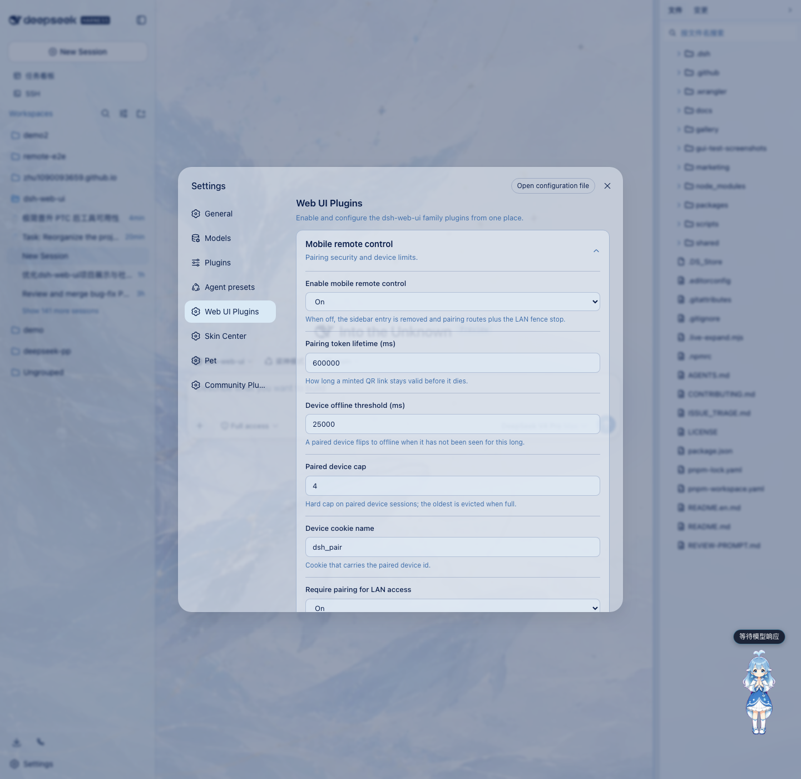
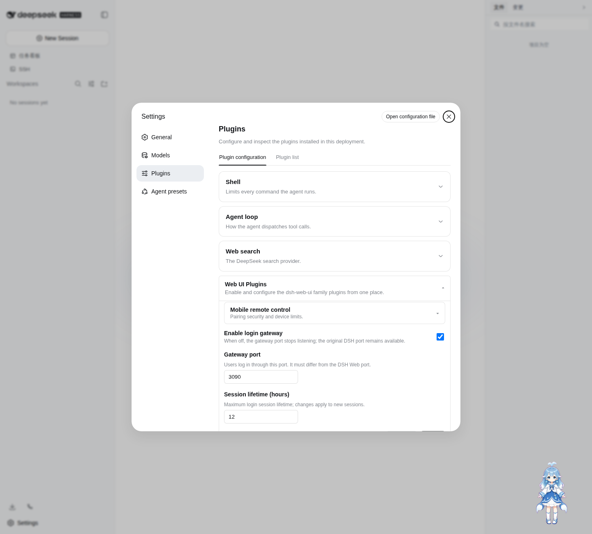
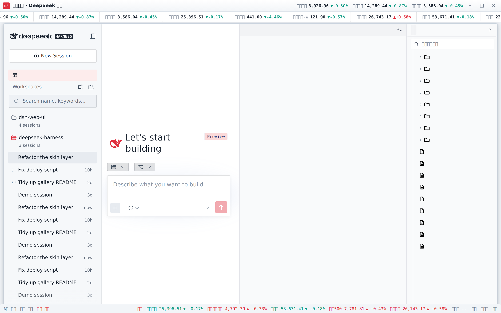
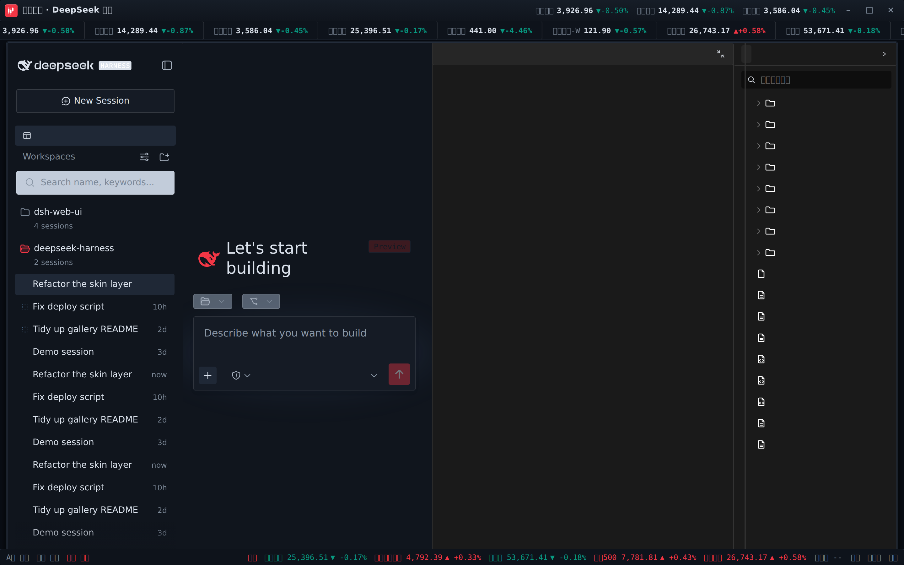

# dsh-web-ui · DSH Web UI

中文 | [English](README.en.md)


dsh-web-ui 是 DeepSeek Harness（DSH）Web UI 的插件与皮肤集合：任务看板、Git 图谱、右侧面板、登录网关、移动端远程、远程连接、鲸鱼娘宠物、实时令牌统计，以及皮肤中心。所有插件既可独立安装，也可通过聚合包一次装齐。


## 功能插件

### 任务看板

在侧边栏点击「任务看板」进入。任务按五列状态组织：待规划、待办、进行中、已完成、已失败。点击卡片上的「执行」，任务将由真实的 DSH 智能体会话执行，完成后状态自动回写；需要复盘时，可直接跳转到执行会话查看完整过程。

任务支持定时执行：在详情中配置 cron 表达式（如每天 23:00 自动升级 DSH、每周一 09:00 生成周报），到点自动开工，无需人工值守。

| 多列看板 | 定时执行 |
| --- | --- |
|  |  |

### Git 图谱

输入框上方的分支选择器，支持切换分支与查看提交历史；Git 图谱将分支泳道与提交历史可视化，仓库再大也能顺着时间线快速定位变更。


### 右侧面板

项目会话打开时，聊天区右侧出现「预览」与「文件/变更」两块面板：

- **文件树**：浏览工作目录，点击文件即在预览面板打开，整行点击展开文件夹，支持按文件名搜索定位；
- **预览**：多标签预览 markdown、HTML、代码、diff、CSV、PDF、Office、图片与文本等格式，支持源码 / 预览切换、分屏编辑与保存；
- **变更（SCM）**：真实 git 变更面板，支持 stage / unstage / discard；
- 面板宽度可拖拽调整，双击把手复位默认宽度，折叠状态与宽度按项目持久化；
- 8 款皮肤全部适配右侧面板，换肤后面板随之融入主题。


### 鲸鱼娘宠物

一只常驻界面的鲸鱼娘宠物，会跟随智能体的状态切换动画：思考、等待、工作、庆祝。点击可互动（摸头），投喂小鱼干可提升亲密度，陪伴度从幼鲸一路成长至「深海羁绊」。支持自定义名称、自由拖动位置，也可随时隐藏。

| 陪伴工作 | 互动面板 |
| --- | --- |
|  |  |

### 实时令牌统计

在输入框下方实时显示生成速度（TPS）、LLM 耗时、上下文占用、缓存命中率以及输入 / 输出 token 数，每次生成的用量一目了然。


### 移动端远程

侧边栏底部的手机图标打开配对面板：扫码配对（或复制链接）后，手机进入独立的移动端界面，远程控制当前 dsh web 工作区——查看与新建会话、收发消息、切换模型与思考强度、调整权限预设，全部与桌面端同步。配对令牌一次性且限时，「停止」可随时吊销所有设备；二维码默认走局域网，也可开启 cloudflared 公网隧道，让手机在任意网络配对。

> **实时消息与隧道**：移动端依赖 SSE（Server-Sent Events）实时接收消息。Cloudflare quick tunnel（trycloudflare.com）与 Tailscale Serve 不透传 SSE，普通 HTTP 正常、实时推送不可达；此场景下插件自动降级为轮询，可正常收发消息，仅新消息可能延迟数秒到达。需要即时推送请使用支持 SSE 的隧道（Cloudflare named tunnel、自定义 TCP 端口转发等）。

| 工作区列表 | 会话列表与新建会话 |
| --- | --- |
|  |  |
| 聊天（折叠的深度思考与工具调用） | 模型与思考强度选择 |
|  |  |

### 远程连接

侧边栏「SSH」入口打开远程运维面板。主机支持密钥 / 密码认证，可从 `~/.ssh/config` 一键导入；配置统一存于 `~/.dsh/dsh-ssh.json`。对已配置主机可执行真实操作：

- **Web 终端**：xterm.js 远程终端，实时输出、随窗口自适应；
- **文件传输**：SFTP 上传 / 下载，带进度条与远程目录浏览；
- **端口转发**：本地隧道直达远程内网服务（数据库、API、管理后台），仅监听 127.0.0.1；
- **集群执行**：一条命令并发跑多台主机，按别名 / 环境 / 标签过滤；
- **Agent 直连**：Agent 与面板共享同一份主机配置，对话中直接说「连一下 xxx 看看状态」即可由智能体执行远程命令。

### 设置中心

全部插件的开关与参数统一收纳于「设置 > 插件配置」，修改即时生效。



### 登录网关

在独立端口提供 DSH Web 登录页，认证成功后统一代理页面、API 与 WebSocket 请求。首次访问创建管理员账号；网关端口和会话有效期在「设置 > 插件配置」中修改。DSH 原始端口应只绑定 `127.0.0.1` 或其他可信接口，避免绕过网关。



## 皮肤

皮肤中心提供 8 款皮肤，均支持先试穿再应用：试穿即时生效、退出完全还原，确认满意后一键应用。


### Windows XP（Luna）

还原 Luna 经典界面：蓝色渐变窗口条、绿色「开始」按钮、Bliss 蓝天桌面，全局直角风格。


### Minecraft 方块世界

以《我的世界》主界面为灵感：像素全景天空盒在界面后方缓慢旋转，按钮为灰石板样式，输入框为木告示牌样式。


### Blue Fantasy 蓝色幻想

鲸鱼插画铺于半透明面板之下，靛蓝色调色板贯穿全局，暗色主题下效果尤为突出。


### 鲸吟（Whale Song）

深海鲸语女神主题：无文字纯氛围背景画（蓝发女神与鲸群居左、冰蓝星座网格与金色细线点缀、右侧大量留白）垫在半透明面板之下，冰蓝 / 浅青 / 深海军蓝 / 钴蓝冷色体系贯穿全局，暗色变体为深海夜航调。

 · 

### 交易终端（Trading Terminal）

带实时行情的炒股皮肤：顶栏滚动跑马灯（A股 / 港股 / 美股 / 指数 / 加密 / 外汇，红涨绿跌），标题栏行情快签，状态栏展示 A股 / 港股 / 美股交易时段与港美股指数。已安装 `dsh-fun-ticker` 时跑马灯跟随你的自选列表（同源代理取数），已安装 `dsh-longbridge` 时指数格渲染长桥券商快照；两个插件都没装也能直接走公共行情源（腾讯 / 币安 / Frankfurter）独立工作，所有路径失败都安全降级为 `--`。

 · 

其余三款：QQ2008 怀旧版（水晶蓝配色与企鹅元素）、同花顺风格（行情元素融入界面）、龙的传人（朱砂龙印主题）。

## 安装

DSH 插件通过 `dsh plugin` 命令安装进 **profile**（`dsh web` 对应 `web` profile）。推荐直接安装聚合包 `dsh-web-ui-all`——一个包装齐全部功能插件与皮肤；只想用皮肤则装 `dsh-skins`。

### 方式一：从 npm 安装（推荐）

插件已发布到 npm（`@linxin666` scope），一条命令装齐：

```sh
dsh plugin --profile web add @linxin666/dsh-web-ui-all@0.1.10
```

装完重启 `dsh web`，侧边栏即可看到全部插件入口。只想用皮肤则装 `@linxin666/dsh-skins`。

> 版本固定为当前最新发布版 `0.1.10`。`0.1.1` 的 `dsh-pet` 缺少运行时文件（`lib/types/*.js`），且个别环境对 npm `latest` 的解析可能受 registry 缓存影响，带版本号安装最稳妥；升级时把 `@0.1.10` 换成新版本号。

> 首次安装若提示 `ERR_PNPM_IGNORED_BUILDS`（pnpm 拒绝依赖的构建脚本），按提示把 `cloudflared` / `cpu-features` / `ssh2` 加入 profile 的 `pnpm-workspace.yaml` `allowBuilds` 后重新执行即可。

### 方式二：从 GitHub 仓库安装（改代码调试）

插件包已在 npm 发布，仓库安装仅供开发调试（需要 Node.js >= 22 与 pnpm）：

```sh
# 1. 克隆仓库
git clone https://github.com/zhu1090093659/dsh-web-ui.git
cd dsh-web-ui

# 2. 安装依赖并构建
pnpm install
pnpm -r build

# 3. 把全家桶链接进 web profile（推荐，先链接全部子包再注册聚合包）
node scripts/link-profile.mjs
dsh plugin --profile web add link:$(pwd)/packages/dsh-web-ui-all

# 4. 重启 dsh web，侧边栏即可看到全部插件入口
dsh web
```

> 只想用皮肤：第 3 步只执行 link-profile 后安装 `packages/dsh-skins` 即可。
>
> 注意：profile 目录不是 pnpm workspace，聚合包里的 `workspace:*` 依赖会回退拉取 npm 已发布版本；
> 若 npm 版本滞后或损坏会出现「宿主已挂载但 UI 不显示」，此时先用 `node scripts/link-profile.mjs`
> 让全部子包走仓库构建产物。

### 单独安装某个插件

不想装全家桶时，可单独安装任意插件（npm 已发布，直接用包名）：

```sh
dsh plugin --profile web add @linxin666/dsh-client-ui-task-board   # 任务看板
dsh plugin --profile web add @linxin666/dsh-ssh                    # 远程连接（SSH）
dsh plugin --profile web add @linxin666/dsh-pet                    # 鲸鱼娘宠物
```

### 验证与卸载

安装成功后重启 `dsh web`，侧边栏出现对应入口即生效；也可用 `dsh --profile web --dump-config` 确认插件配置层已挂载。若侧边栏没有新入口，多半是安装后没有重启 `dsh web`。

卸载：`dsh plugin --profile web remove @linxin666/dsh-web-ui-all`，然后重启 `dsh web`。

技术细节见 [docs/plugins.md](docs/plugins.md)。

## 来源与版权

| 包 | 来源 | 版权 |
| --- | --- | --- |
| dsh-task-board / dsh-git-graph / dsh-aionui-panel / dsh-pet / dsh-remote-web-ui / dsh-live-stats / dsh-web-auth-gateway / dsh-web-ui-settings / dsh-skins / dsh-web-ui-all / skins | 作者 zhu1090093659 个人开发 | BSD-3-Clause（zhu1090093659） |

迁入第三方代码必须保留 LICENSE 与署名；活跃且有上游的第三方优先 fork 或依赖引用，不搬代码。

## 友情链接

- https://linux.do

## Star 历史

[](https://www.star-history.com/?repos=zhu1090093659%2Fdsh-web-ui&type=date&legend=top-left)
