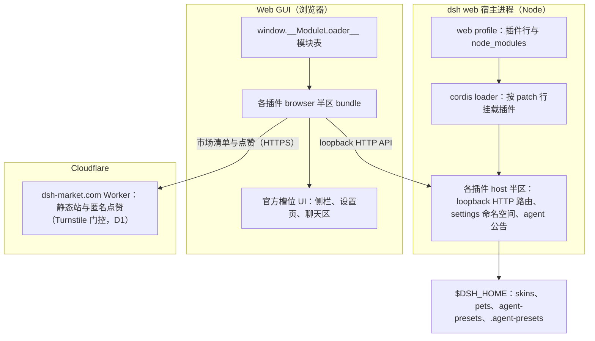
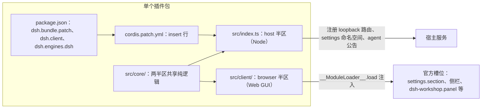
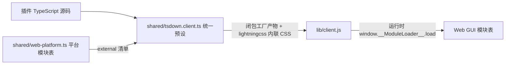
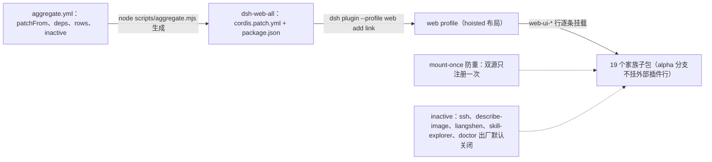
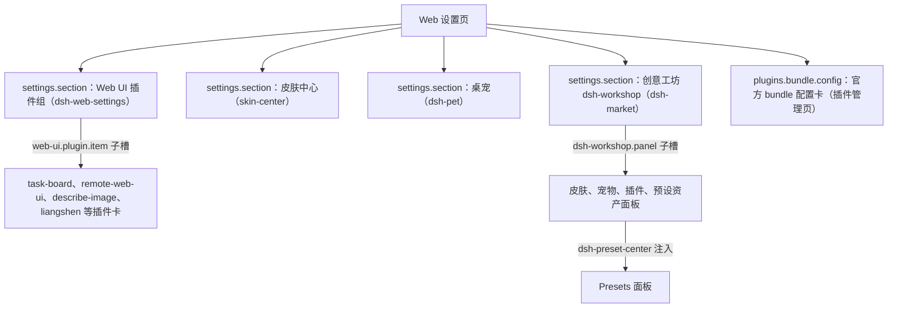
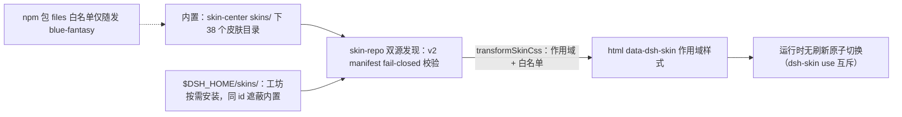
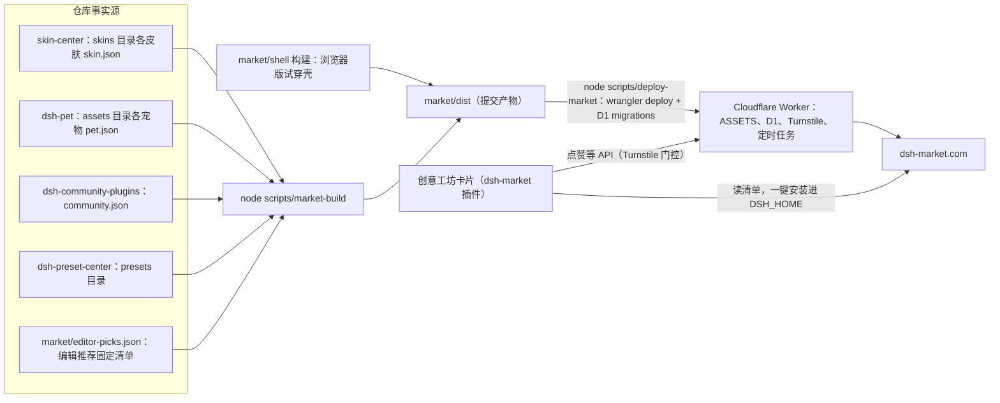
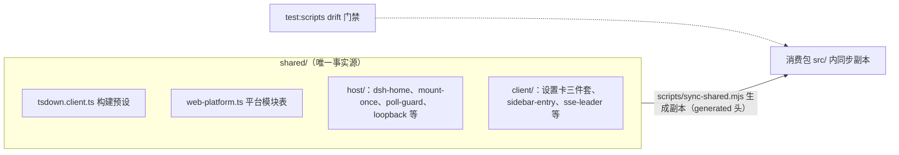
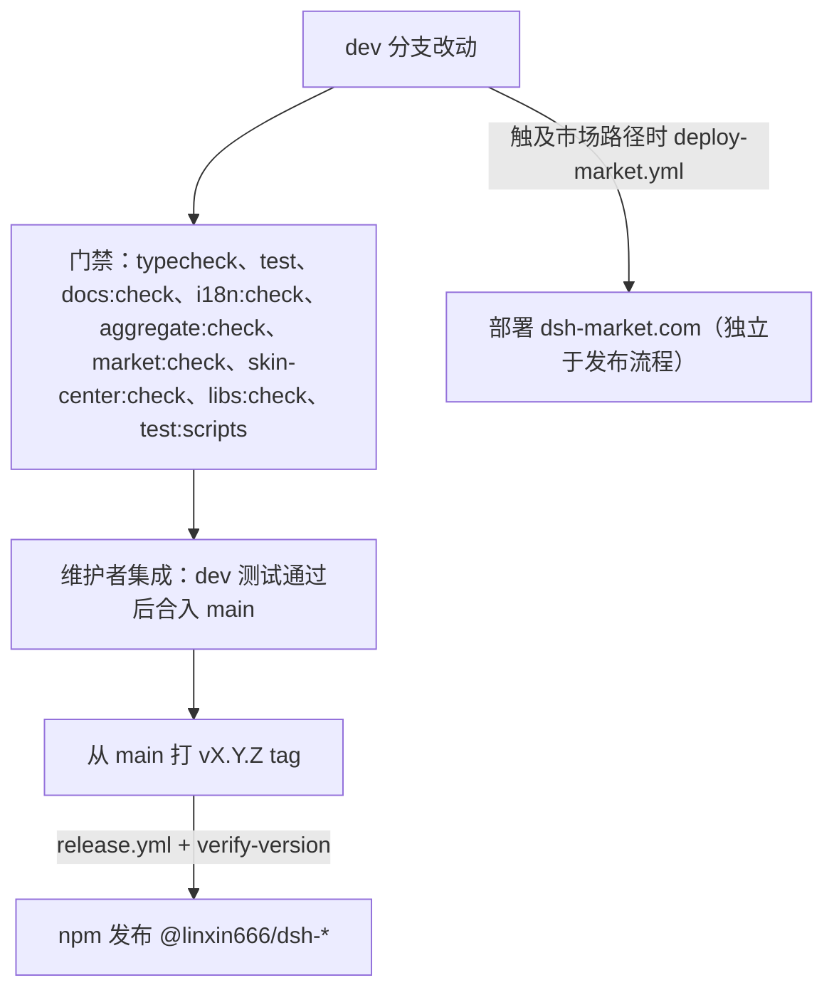

# 架构设计图（architecture）

本文用架构图给出 dsh-web 的整体结构与运行时关系，作为跨包导览。各事实的归属文档不变：仓库规则见根 [AGENTS.md](../AGENTS.md)，包级规则见 [packages/AGENTS.md](../packages/AGENTS.md)，文档标准见 [AGENTS.md](AGENTS.md)，开发流程见 [development.md](development.md)，新插件入桶见 [plugins.md](plugins.md)。

dsh-web 是 DeepSeek Harness Web 的插件 monorepo，皮肤以皮肤中心插件的纯资产包形式存在、经创意工坊分发。插件包只经 `cordis.patch.yml` 与 profile 挂载进 dsh web 宿主；类型只来自官方 `@deepseek-ai/*` NPM SDK（node_modules 解析），不依赖任何 DSH 源码 checkout。

## 全景总览

宿主进程按 profile 的 patch 行挂载各插件 host 半区；浏览器 GUI 经 `window.__ModuleLoader__` 模块表加载各插件 browser 半区；两侧经宿主 loopback HTTP 通信。市场站独立部署在 Cloudflare 上，插件与站点之间只有 HTTPS 清单读取与 Turnstile 门控的匿名写入。



## 仓库目录分层

```text
dsh-web/
├── packages/            # 插件 monorepo：功能插件、皮肤中心、聚合包 dsh-web-all
│   ├── <name>/          # 独立 cordis bundle 包（host + client 两半区）
│   └── skins/           # skin-center：唯一皮肤包，skins/ 下为纯资产皮肤目录
├── shared/              # 跨包事实源：构建预设、平台模块表、host 与 client 运行时模块
├── scripts/             # 仓库维护工具（aggregate、sync-shared、market-build、verify-docs 等）
├── market/              # dsh-market.com：src 静态站源、shell 试穿壳、dist 提交产物、worker 边缘 API
├── desktop/             # Electron 桌面应用（桌面启动场景）
└── docs/                # 长期文档、发布说明与归档
```

## 插件包解剖

每个包是独立 cordis bundle：`package.json` 的 `dsh.bundle.patch` 指向包内 `cordis.patch.yml`（官方 bundle 清单，`dsh plugin` 依赖它识别与挂载）；`dsh.client` 声明浏览器半区需要注入的模块（`inject`）与 `platform: "web"`；`dsh.engines.dsh` 声明最低宿主版本。源码按 host / client / core 三区组织，规则见 [packages/AGENTS.md](../packages/AGENTS.md)。



## 浏览器半区构建与模块注入

构建统一走 [shared/tsdown.client.ts](../shared/tsdown.client.ts) 预设，产出闭包工厂 bundle：运行时调用 `window.__ModuleLoader__.load` 注入 GUI，external 不打包、经宿主注入的模块表 require 解析。平台模块表 [shared/web-platform.ts](../shared/web-platform.ts) 冻结 react、cordis 与 `dsh-client-ui-*` 等成员，播种、打包 external 与 Vite alias 共用同一清单。CSS Modules 由 lightningcss 编译内联进 bundle。浏览器侧纯度门：`@deepseek-ai/*` 只能 type-only 导入，值导入仅限平台种子表成员，跨插件协作走 cordis 服务或 slot。



## 聚合包挂载链

[dsh-web-all](../packages/dsh-web-all/aggregate.yml) 是一键装齐全家桶的载具包：`aggregate.yml` 列出 `patchFrom`、`deps`、外部行与默认关闭行，[scripts/aggregate.mjs](../scripts/aggregate.mjs) 生成聚合 `cordis.patch.yml`（子插件行 id 统一加 `web-ui-` 前缀，与独立包安装共存）与 `workspace:*` 依赖；生成文件勿手改，`aggregate:check` 防漂移。profile 侧需 hoisted 布局让 loader 从顶层解析子包；本地开发用 [scripts/link-profile.mjs](../scripts/link-profile.mjs) 把构建产物链进 profile 的 `@linxin666` 命名空间。host 半区经 `mount-once` 防重：同一插件双源加载只注册一次。



## 设置页槽位体系

设置页的家族入口分两级：一级设置分区（`settings.section`）由 dsh-web-settings（Web UI 插件组）、皮肤中心、桌宠、创意工坊（`dsh-workshop`）各自注册；组内插件卡走 `web-ui.plugin.item` 子槽，创意工坊的资产面板走 `dsh-workshop.panel` 子槽（Presets 面板由 dsh-preset-center 注入）。host 侧用 `installSettingsSection` 注册命名空间，browser 侧用 `settingsScope.bind` 读写；官方插件管理页用 `plugins.bundle.config` 槽承载插件自带配置（按 bundle 包名分派，渲染在该 bundle 的页面上），alpha.2 起旧的 `settings.plugin.item` 槽已不存在。



## 皮肤系统

皮肤是纯资产目录：仓库内位于皮肤中心的 `skins/`（38 个内置皮肤），npm 包 `files` 白名单只随发默认皮肤 blue-fantasy，其余由创意工坊按需安装到 `$DSH_HOME/skins/<id>/`（同 id 遮蔽内置）。skin-repo 双源发现并做 v2 manifest fail-closed 校验；样式经 `transformSkinCss` 安全管线强制作用域到 `html[data-dsh-skin]` 并按白名单过滤；启用互斥由 `dsh-skin use` 客户端原子切换管理，不改 `cordis.patch.yml`。插件输出语义属性（`data-dsh-plugin` / `data-dsh-part`）才承诺完整换肤覆盖，契约见 [semantic-attrs-v1.md](../packages/skins/skin-center/contracts/semantic-attrs-v1.md)。



## 创意工坊与市场站

仓库是市场内容的唯一事实源：皮肤取 skin-center 的 skin.json、宠物取 dsh-pet 的 pet.json、插件取 community.json、预设取 dsh-preset-center 的 presets/、编辑推荐取 market/editor-picks.json（手工维护的皮肤 / 宠物 / 插件引用清单，构建时逐条校验可解析），[scripts/market-build](../scripts/market-build) 派生 `market/dist`（`manifest/{skins,pets,plugins,presets,editor-picks}.json`、预览与试穿资产；产物提交进仓，`market:check` 校验一致）。tryon 试穿壳来自 market/shell 的构建产物，拷入 `dist/tryon/`。部署经 [scripts/deploy-market](../scripts/deploy-market)：先 `market-build --check`，再 wrangler 应用 D1 migrations 并部署 [Worker](../market/worker/wrangler.jsonc)（ASSETS 绑定 dist、Turnstile secret 守卫）；push 到 dev 且触及市场相关路径时由 [deploy-market.yml](../.github/workflows/deploy-market.yml) 自动上架。匿名点赞必须保持 Turnstile 门控并经单个 D1 batch 写入（信任边界见根 [AGENTS.md](../AGENTS.md)）。



## 共享层与同步管线

[shared/](../shared/tsdown.client.ts) 是跨包事实源：构建预设与平台模块表之外，`host/` 提供 dsh-home 解析、mount-once、poll-guard、run-guarded、loopback 等宿主侧模块，`client/` 提供设置卡三件套、侧栏入口、sse-leader 等浏览器侧模块。[scripts/sync-shared.mjs](../scripts/sync-shared.mjs) 把副本生成进各消费包（带 generated 头，禁手改），`test:scripts` 的 drift 门禁防副本漂移。四个包（dsh-market、dsh-preset-center、dsh-web-all、skin-center）提交 `lib/` 构建产物，指纹由 `libs:write` 记录、`libs:check` 把关。



## DSH_HOME 数据目录

| 路径 | 用途 | 管理者 |
| --- | --- | --- |
| `$DSH_HOME/profiles/<name>/` | profile：插件行与 node_modules（`@linxin666` 命名空间可被 link-profile 链接到本地构建） | `dsh plugin`、scripts/link-profile.mjs |
| `$DSH_HOME/skins/<id>/` | 用户皮肤资产，同 id 遮蔽内置 | 皮肤中心、创意工坊按需安装 |
| `$DSH_HOME/pets/` | 宠物资产、装饰与语音配置 | dsh-pet、创意工坊按需安装 |
| `$DSH_HOME/agent-presets/<id>/` | 预设库：市场下载落盘于此；宿主半区把它声明给 agent preset 注册表后才生效 | dsh-preset-center、dsh-liangshen |

## 家族包一览

下表仅作导览；权威描述以各包 `package.json` 与 README 为准，聚合关系以 [aggregate.yml](../packages/dsh-web-all/aggregate.yml) 为准。

| 包 | 职责 |
| --- | --- |
| dsh-web-all | 聚合载具包：一键装齐全家桶（含 compat 桥接层） |
| dsh-web-settings | 设置页一级分区：家族插件启停开关与配置表单（`web-ui.plugin.item` 子槽） |
| dsh-plugin-manager | 插件管理页：npm/git 安装、启停、冲突恢复 |
| dsh-market | 创意工坊商店卡：浏览 dsh-market.com 并一键安装皮肤、宠物、插件、预设 |
| dsh-preset-center | 社区预设：惰性库、启停、工坊 Presets 面板 |
| dsh-community-plugins | community.json 社区插件索引数据源（惰性 cordis 行） |
| skins/skin-center | 皮肤中心：皮肤资产、试穿、无刷新原子切换 |
| dsh-pet | 注册表驱动桌宠：响应模型活动、命名与好感度 |
| dsh-task-board | 宿主权威任务板：真实会话执行与 cron 调度 |
| dsh-git-graph | 空会话 git 分支选择器与提交图 |
| dsh-ssh | 远程 SSH：PTY 终端、SFTP、端口转发与 agent 工具 |
| dsh-remote-web-ui | 扫码配对远程访问与可撤销设备会话 |
| dsh-session-archive | 会话归档：批量归档恢复、级联删除、自动清理策略 |
| dsh-session-id | 侧栏底部 Session ID 面板（纯浏览器半区） |
| dsh-usage | 用量统计：provider 余额、套餐配额与实时 token 流水 |
| dsh-doctor | profile 事务性抢救模式与本地恢复控制台 |
| dsh-skill-explorer | 技能中心：按来源浏览、启停、创建技能 |
| dsh-model-capabilities | 自定义 provider 的按模型能力声明 |
| dsh-tool-describe-image | 面向模型的 describe_image 工具（VLM 图像理解） |
| dsh-liangshen | 梁神 agent 预设与模式拨杆 |
| dsh-i18n | 俄语语言包与全家族 ru 词典 |

## 门禁与发布流

日常与合并门禁的执行方式见 [development.md](development.md)；发布流程见 [publish-prep.md](publish-prep.md)：tag 是版本唯一来源，[release.yml](../.github/workflows/release.yml) 在 tag 推送后用 scripts/verify-version.mjs 校验各包版本与 tag 一致，再发布 `@linxin666/dsh-*`。市场站不走 npm 发布：dev 分支自动部署，main 不触发部署。


