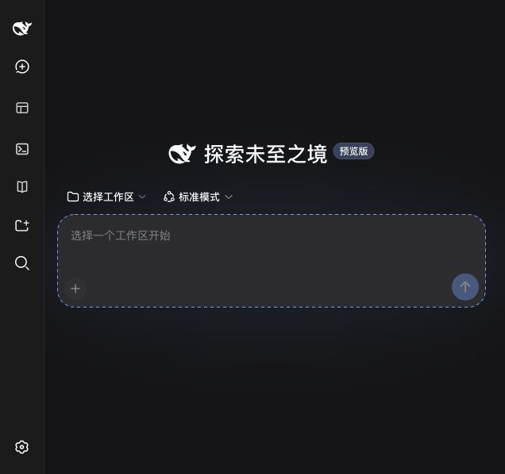
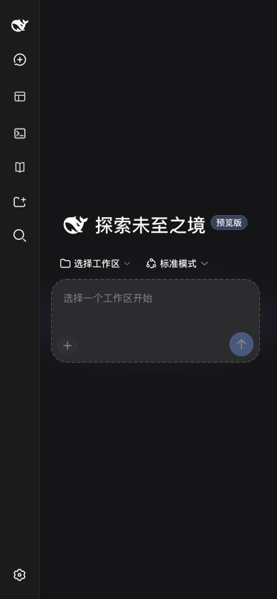
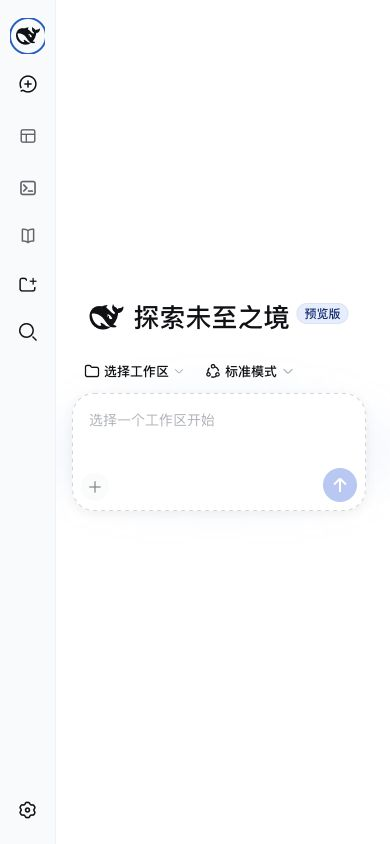

# Official default sidebar alignment verification

Verified on 2026-08-30 against `dev` commit `5bb1cd49638a4773ae36e9c75d4a305c7b8004e4`, with Task Board and SSH at version `0.3.8` plus this fix.

## Existing issue and PR check

[PR #1004](https://github.com/zhu1090093659/dsh-web/pull/1004) changes aggregate narrow-screen layout. [PR #892](https://github.com/zhu1090093659/dsh-web/pull/892) normalizes SSH icon sizing. [Issue #1112](https://github.com/zhu1090093659/dsh-web/issues/1112) and the follow-up `b1f63464` address the skill-explorer standalone entry. None applies the native collapsed selector to both Task Board and SSH on this base. Skill Explorer already aligns correctly and is left unchanged.

## Isolated runtime

- Worktree: `/tmp/dsh-mobile-sidebar.0XAfeE/worktree`, branch `codex/fix-mobile-sidebar-icons`.
- DSH state: `/tmp/dsh-mobile-sidebar.0XAfeE/state-node22`; no existing user state, credentials, workspaces, sessions, or SSH hosts copied.
- GUI: `http://127.0.0.1:57925/`, profile `web`, Node `22.23.2`.
- Official SDK cohort: `0.1.2-alpha.1`, bootstrapped with the repository's `scripts/build-cohort-tarballs.mjs` from unmodified upstream commit `cd5ef8148158c3a752a658978873241fdf8e2bbc`. Packages are resolved from `node_modules`; no DSH source or tsconfig source link is changed. Runner-local tarball integrity changes are excluded from the fix.
- Bundles: official `dsh-base` and `dsh-web-app`, with locally built Task Board, SSH, and Skill Explorer. No aggregate bundle or custom skin is mounted. The live DOM has native `data-sidebar-collapsed` and zero `data-dsh-frame` elements.
- Browser validation uses the in-app browser with CSS viewport sizes, not physical-device Safari testing. API-key onboarding is skipped; no agent run or SSH connection is started.

The initial Node 25.1 runtime cannot compose the current SDK's client graph because of a Node internal-loader API mismatch. The separate Node 22 state above boots normally. No existing DSH process is stopped or restarted.

## Reproduction and observed geometry

All coordinates below are settled-state CSS pixels measured from the actual SVG bounding boxes. The rail is 56px wide.

| Entry | Before, 636 x 598 dark | After, 636 x 598 dark | After, 390 x 844 dark/light | After, 1440 x 900 light |
| --- | --- | --- | --- | --- |
| Native New Session | 28 | 28 | 28 | 28 |
| Task Board | 32 | 28 | 28 | 28 |
| SSH | 32 | 28 | 28 | 28 |
| Skill Explorer | 28 | 28 | 28 | 28 |

Before the fix, the affected buttons retain `padding: 0 10px`, normal justification, and visible label boxes. After the fix, they have zero horizontal padding, centered content, and hidden labels. The existing mobile Task Board touch height remains 44px; this change does not resize it.

At 390px and 1440px, expanding the rail restores visible Task Board and SSH labels and `0 10px` padding. Collapsing it again restores the shared 28px icon centerline. Clicking each collapsed entry opens its actual empty panel; the active icon remains centered, and Return to Session restores the conversation. No warning or error belongs to the working `57925` runtime in the browser log; the two older errors belong only to the abandoned Node 25 instance on `55393`.

## Regression and repository checks

The new DOM/CSS tests fail on the unmodified styles only for the native frame without `data-dsh-frame` (one failure per affected package); the aggregate-decorated fixtures pass. With the fix, all six focused tests pass, including restoration of expanded labels and padding.

Final repository gates run with Node `22.23.2` and the repository-pinned pnpm `11.24.0` via `pnpm_config_verify_deps_before_run=warn npm exec --yes --package=node@22 --package=pnpm@11.24.0 -- <command>`:

```sh
pnpm --filter @linxin666/dsh-client-ui-task-board --filter @linxin666/dsh-ssh exec vitest run tests/sidebar-entry-layout.spec.ts
pnpm typecheck
pnpm test
pnpm build
pnpm test:scripts
pnpm docs:check
pnpm runtime-deps:check
pnpm sync-shared:check
pnpm aggregate:check
git diff --check
```

All listed checks pass. After the full build, script tests report 226 passed, zero failed, zero skipped. SDK sourcemap/deprecation messages and test-environment media stubs remain non-failing warnings. CodeGraph `sync`, `status`, and `index` were attempted but the executable is not installed; code navigation and impact review use `rg` and the focused diff instead.

Restoring the tracked lockfile removes only runner-specific SDK tarball hashes. pnpm's default pre-run reinstall then encounters the maintainer-specific absolute cohort path in the workspace configuration. The final checks use `verify_deps_before_run=warn` to retain the already-installed, verified cohort instead of reinstalling it; the warning is visible, and no package, lockfile, or workspace configuration change is committed.

## Screenshots

Before, default dark skin at 636 x 598:


After, same default dark skin and viewport:



Phone viewport at 390 x 844, dark and light:





Desktop expanded at 1440 x 900, with labels restored:


