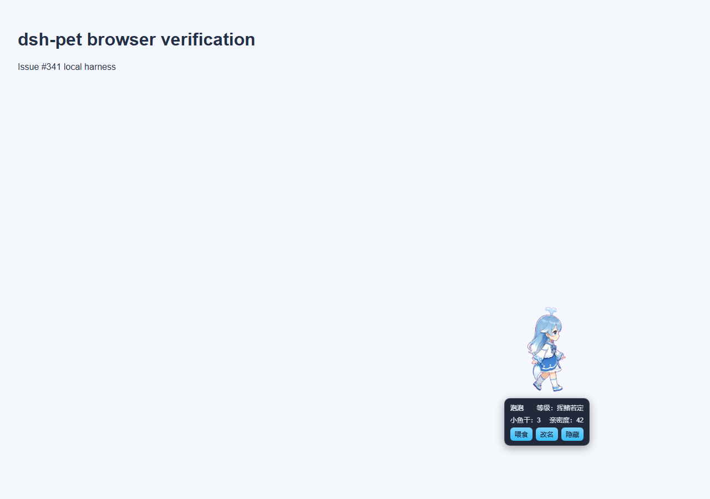

# dsh-pet issue #341 browser validation

Date: 2026-08-17

Branch: `feat/pet-interaction-sequences` at `7470536`

## Scope

This snapshot records local Chromium validation of the real `PetSprite.tsx`, the built-in whale manifest, and the built-in whale spritesheet for issue #341.

## Method

A temporary Vite harness rendered the component at 1280 x 900 with the whale `thinking` scene active. Playwright sampled the inline spritesheet position, hovered the pet, measured the pet and panel boxes, moved the pointer through the complete gap in 2px steps, waited 400ms, and captured the page. The temporary harness was removed after the run.

## Result

- Scene sequence: PASS. The sprite moved from the `running` row (`0px -1120px`) to the next `running-right` row (`0px -160px`) after the first track completed.
- Panel placement: PASS. The pet box was `{ x: 912, y: 550, width: 148, height: 160 }`; the panel box was `{ x: 909, y: 718, width: 154, height: 86 }`, placing the panel 8px below the pet.
- Hover bridge: PASS. The panel remained mounted after the pointer crossed the full 8px gap and the 400ms grace window elapsed.

## Evidence

## Limitation

The machine did not have the `dsh` CLI installed, so this run did not validate installation into a live `dsh web` profile. Host service and route behavior remain covered by the package test suite.
