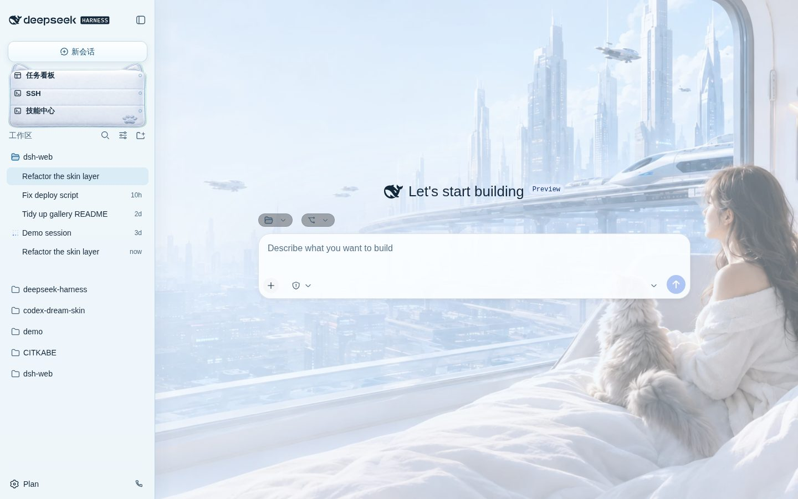
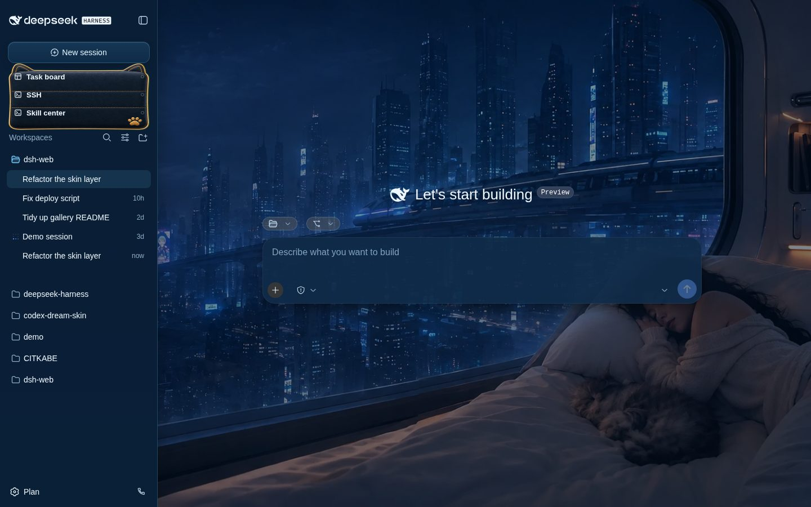
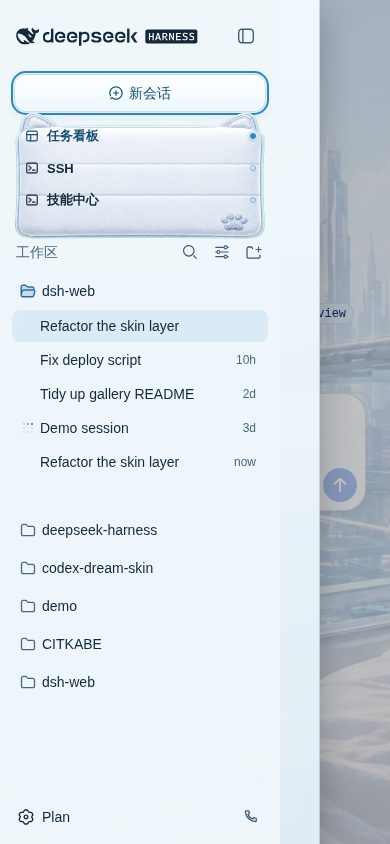
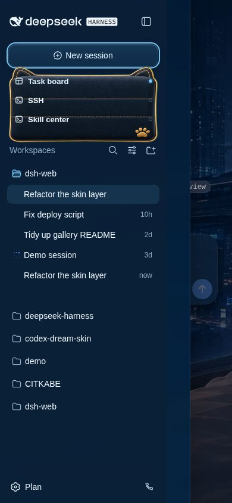

# 云轨舱窗 PR #1087 视觉验证

本快照使用仓库 `gallery/official-facade.js` 的脱敏官方 GUI 骨架、`packages/dsh-web-all/src/client/index.ts` 的生产响应式 CSS，以及 `future-window` 的实际亮暗资源生成；不包含用户会话数据。亮色快照使用中文，暗色快照使用英文，以验证新会话按钮不依赖本地化文案。

## 桌面 1440×900

| 亮色 | 暗色 |
| --- | --- |
|  |  |

## 窄屏 390×844（侧栏展开）

| 亮色中文 | 暗色英文 |
| --- | --- |
|  |  |

## 自动化观测

- 展开态：390px 视口中侧栏宽 320px；软枕跟随入口行为 254×129px，三行入口边界均为 x=12–268px、y=120–216px；软枕底边为 y=239px，Workspace 从 y=242px 开始，互不遮挡。
- 折叠态：侧栏宽 52px，软枕伪元素计算值为 `display: none`，折叠切换按钮仍可见。
- 本地化：亮色按钮的 `aria-label` 为「新会话」，暗色为 `New session`，两者均命中 `data-dsh-part="new-session"`。
- 键盘：新会话按钮聚焦时获得 2px 实线轮廓。
- 减少动态效果：`prefers-reduced-motion: reduce` 下悬浮入口的计算 `transform` 为 `none`。
