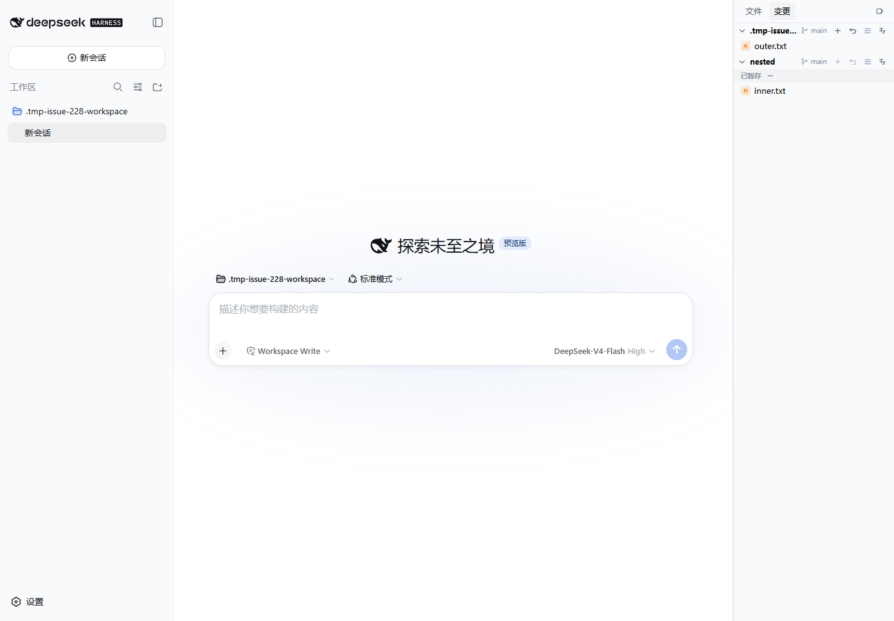
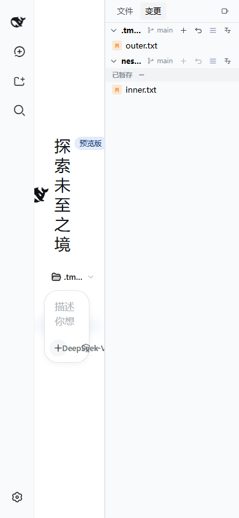

# Issue #228 Nested Git GUI Validation

## Environment

- Date: 2026-08-18
- Branch: `fix/nested-git-repositories`
- DSH CLI: `0.1.0-rc.7`
- URL: `http://127.0.0.1:3192`
- Profile: isolated `DSH_HOME` with `@linxin666/dsh-client-ui-aionui-panel` linked from this worktree
- Browser: Playwright Chromium, desktop `1440x1000` and narrow `390x844` viewports

## Scenario

The test workspace contained an outer Git repository with `nested/` ignored by the outer `.gitignore`, plus an independent Git repository at `nested/`. `outer.txt` and `nested/inner.txt` were each modified after their baseline commits. The workspace was registered through the real DSH `workspace.create` API, a blank session was opened, and the Changes tab was selected.

## Result

- The Changes tab displayed the outer repository (`main`, `outer.txt`) and the nested repository (`main`, `inner.txt`) as separate sections.
- Clicking the nested `inner.txt` stage action moved it to the nested section's staged group.
- The outer repository index remained empty; the nested repository index contained only `inner.txt`.
- The browser reported no console errors or page errors.
- Desktop and narrow viewports had no document or body horizontal overflow.

## Limitation

The validation uses an isolated local DSH profile and temporary repositories. It does not send a model prompt; it exercises the mounted SCM UI, host routes, real Git commands, and nested-repository stage path directly.
