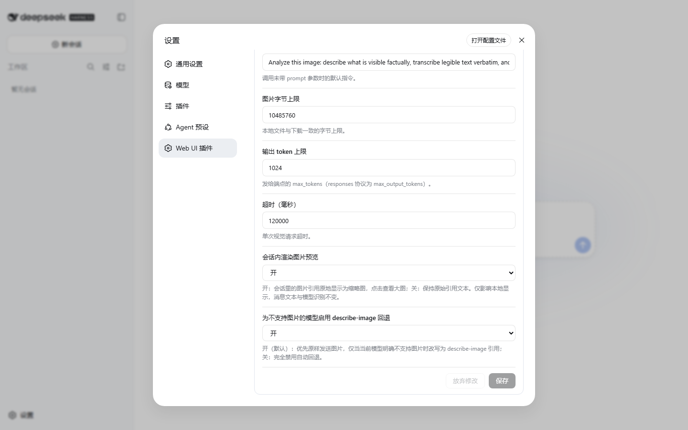
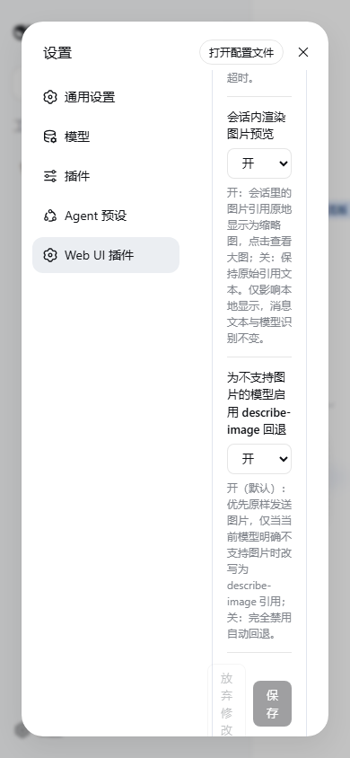

# Issue 440 native image fallback GUI validation

Validated on 2026-08-17 with DSH CLI `0.1.0-rc.7` and the local `fix/describe-image-native-multimodal` package linked into an isolated `web` profile. The real DSH Web GUI ran at `http://127.0.0.1:3080`.

The affected package passed its build, typecheck, and all 162 tests before the GUI run. In the GUI, Settings -> Web UI Plugins -> Image understanding loaded from the local bundle, expanded successfully, and displayed the native-first `interceptImageSend` label and hint. Both desktop and 390 x 844 viewports kept the control reachable. Browser console errors and failed requests were empty in both runs.

The isolated profile had no model or external vision endpoint credentials, so an actual multimodal model request was not sent. Native success, authoritative capability fallback, unrelated attachment errors, upload failure, live settings, and hook idempotence are covered by `tests/send-hook.spec.ts`.

At 390 px, the upstream DSH settings shell keeps its desktop-width navigation column and leaves a narrow content column. The control remains reachable but wraps heavily; this layout limitation is outside issue 440.

## Desktop

## Mobile

